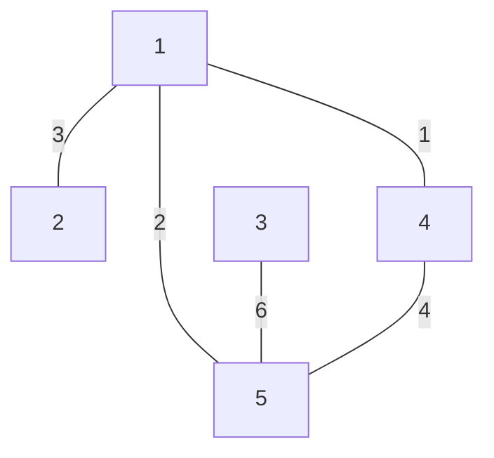

# 第 4 章 4.6—4.8 · 暂态停留、分枝过程与时间可逆性

> **教材依据：** Ross《概率模型导论》（Introduction to Probability Models），第 13 版，4.6—4.8，教材页 253—269。
>
> **学习方式：** 承接前面的状态分类、平稳分布和第一步分析，以中文解释，英文标注术语。先明确问题，再解释公式的来源，最后总结通用解题方法。

## 1. 逻辑地图：这三节分别深化了什么？

前面已经学过：怎样判断状态会不会返回，怎样求长期占比，以及怎样用第一步分析求到达概率与时间。这三节沿着三个方向继续推进：

| 章节 | 核心问题 | 主要工具 | 与前面知识的联系 |
|---|---|---|---|
| **4.6 暂态中的平均停留时间** | 最终离开暂态之前，每个状态平均被访问多少次？ | 暂态子矩阵、基本矩阵 | 第一步分析 + 线性方程 |
| **4.7 分枝过程** | 每个个体独立繁殖，种群如何增长，是否最终灭绝？ | 条件期望、全方差、固定点方程 | 给定本代人数，下一代就是固定项数的和 |
| **4.8 时间可逆链** | 把平稳轨迹倒过来看，转移规律会不会改变？ | Bayes 公式、细致平衡、环路判据 | 平稳分布 + 状态间的概率流 |

三节并不构成一条必须依次套用的公式链，但它们使用同一种思考方式：

> **先找到一个容易描述的局部关系，再把局部关系组织成整体结论。**

4.6 看第一步后还要访问多少次；4.7 看第一代产生了几个独立家族；4.8 看一条边的正向流量与反向流量。

**记号约定。** $P$ 是转移矩阵，$P_i,E_i$ 表示从 $X_0=i$ 出发的概率与期望。4.6 的 $P_T,S$ 沿用教材；4.7 用 $q$ 表示灭绝概率，避免与平稳概率 $\pi_i$ 混淆；4.8 用 $\widehat P$ 表示反向转移矩阵，对应教材的 $Q$。

## 2. 4.6：从长期比例转向“离开之前一共访问多少次”

### 2.1 暂态的长期比例为零，但累计访问次数仍有意义

暂态（transient state）最终只被访问有限次，长期时间比例因此为零。不过，在离开它们之前，系统可能已经花了很多时间、产生了不少成本。

例如赌徒最后会到达破产或获胜边界，但在停止之前，他可能多次拥有 2 元或 5 元。4.6 研究的就是这些**累计访问次数**。

考虑有限状态马尔可夫链，将所有暂态记为

$$
\mathcal T=\{1,\ldots,t\}.
$$

从 $P$ 中取出“暂态到暂态”的部分：

$$
P_T=(p_{ij})_{i,j\in\mathcal T}.
$$

$P_T$ 的每一行之和不超过 1，缺少的概率是一步离开暂态集合的概率。并非每一行都必须小于 1：有些状态要经过其他暂态，才能离开。

离开所有暂态后，链进入某个封闭常返类（closed recurrent class），此后不会再返回暂态。这个封闭类可以包含多个状态，不一定只有一个吸收态。

### 2.2 $s_{ij}$ 的含义：起点也计入

对暂态 $i,j$，定义

$$
\boxed{
s_{ij}
=E_i\!\left[\sum_{n=0}^{\infty}\mathbf1_{\{X_n=j\}}\right]
}.
$$

它表示从 $i$ 出发，今后累计处于 $j$ 的期望次数，也可理解为每步长度为 1 时，在 $j$ 的平均总停留时间。

这里从 $n=0$ 开始计数。因此：

- 从 $j$ 出发，最初已经有一次访问，$s_{jj}\ge1$；
- 从其他状态出发，可能根本不到达 $j$，所以 $s_{ij}$ 可以小于 1；
- $s_{ij}$ 是期望次数，可以大于 1，也可以不是整数。

### 2.3 对第一步条件化，得到整个矩阵

设 $\delta_{ij}=1$ 当 $i=j$，否则为 0。它是初始时刻已经贡献的访问次数。

走出第一步后，如果进入暂态 $k$，后续访问 $j$ 的平均次数就是 $s_{kj}$；如果进入常返类，则后续再也不能访问暂态 $j$。于是

$$
\boxed{
s_{ij}=\delta_{ij}+\sum_{k\in\mathcal T}p_{ik}s_{kj}
}.
$$

这仍然是第一步分析（first-step analysis）：

$$
\text{总访问次数}
=\text{当前贡献}
+\text{下一状态出发的后续贡献}.
$$

令 $S=(s_{ij})$。注意 $(P_TS)_{ij}=\sum_kp_{ik}s_{kj}$，所以所有方程合起来成为

$$
S=I+P_TS.
$$

移项得到

$$
\boxed{S=(I-P_T)^{-1}}.
$$

$S$ 通常称为基本矩阵（fundamental matrix）。计算时，行对应起点，列对应被统计的状态。

### 2.4 为什么一个逆矩阵会代表累计访问次数？

从概率角度，还可以写成

$$
\boxed{S=I+P_T+P_T^2+\cdots}.
$$

因为 $(P_T^n)_{ij}$ 是从暂态 $i$ 出发，第 $n$ 步处于暂态 $j$ 的概率。把每个时刻的访问指示变量取期望，再相加，恰好得到累计访问次数的期望。

因此：

| 矩阵项 | 在统计什么？ |
|---|---|
| $I$ | 时刻 0 的访问 |
| $P_T$ | 第 1 步的访问概率 |
| $P_T^2$ | 第 2 步的访问概率 |
| $\cdots$ | 后续所有时刻 |

有限链中，这些状态都确实暂态，级数会收敛，$I-P_T$ 可逆。它是数列 $1+r+r^2+\cdots=1/(1-r)$ 的矩阵版本。

这里必须先正确识别暂态。若把一个封闭常返类也放入 $P_T$，对应访问次数可能无穷，不能直接使用这个逆矩阵公式。

## 3. 4.6 的计算：一个基本矩阵可以回答哪些问题？

### 3.1 用一个小模型把矩阵读明白

考虑状态 $1,2,A,B$，其中 $A,B$ 为吸收态（absorbing states）。转移矩阵按这个顺序排列：

$$
P=
\begin{pmatrix}
\frac12&\frac14&\frac14&0\\
\frac14&\frac12&0&\frac14\\
0&0&1&0\\
0&0&0&1
\end{pmatrix}.
$$

从状态 1 出发，一半概率留在 1，四分之一转到 2，四分之一被 $A$ 吸收；状态 2 的情况对称。

暂态子矩阵及基本矩阵为

$$
P_T=
\begin{pmatrix}
\frac12&\frac14\\
\frac14&\frac12
\end{pmatrix},
\qquad
S=(I-P_T)^{-1}
=
\begin{pmatrix}
\frac83&\frac43\\
\frac43&\frac83
\end{pmatrix}.
$$

从状态 1 出发：

- 平均处于状态 1 的次数为 $8/3$，其中包含初始那一次；
- 平均处于状态 2 的次数为 $4/3$；
- 被吸收之前，一共平均经历 $8/3+4/3=4$ 个暂态时刻。

### 3.2 行和就是离开全部暂态所需的平均步数

令

$$
\tau=\min\{n\ge0:X_n\notin\mathcal T\}.
$$

从暂态出发，在时刻 $0,1,\ldots,\tau-1$ 都处于暂态，恰好有 $\tau$ 个时刻。因此

$$
\boxed{E_i[\tau]=\sum_{j\in\mathcal T}s_{ij}}.
$$

向量形式为

$$
\boxed{\boldsymbol t=S\mathbf1}.
$$

它也满足熟悉的时间递推

$$
\boldsymbol t=\mathbf1+P_T\boldsymbol t.
$$

这里的 $\mathbf1$ 表示先花掉一步。若一开始就在目标吸收态，剩余时间是 0。

同理，若每次处于暂态 $j$ 时产生费用 $c_j$，平均累计费用为

$$
E_i[\text{累计费用}]=\sum_js_{ij}c_j.
$$

访问次数、累计时间、累计费用，实际上使用的是同一组访问量。

### 3.3 从访问次数得到“曾经到达”的概率

教材记

$$
f_{ij}=P_i(X_n=j\text{ 对某个 }n\ge1).
$$

注意要求至少走一步：$i\ne j$ 时它是到达概率；$i=j$ 时它是再次返回的概率。

先看 $i\ne j$。若永远没到达 $j$，贡献 0 次访问；若首次到达 $j$，从这一刻往后，平均访问量与直接从 $j$ 出发相同，即 $s_{jj}$。所以

$$
s_{ij}=f_{ij}s_{jj}.
$$

再看 $i=j$。初始先贡献一次；之后若返回，则重新开始一段从 $j$ 出发的过程：

$$
s_{jj}=1+f_{jj}s_{jj}.
$$

合并得到

$$
\boxed{
f_{ij}=\frac{s_{ij}-\delta_{ij}}{s_{jj}}
}.
$$

在小模型中，

$$
f_{12}=\frac{4/3}{8/3}=\frac12,
\qquad
f_{11}=1-\frac1{8/3}=\frac58.
$$

“平均访问状态 2 共 $4/3$ 次”与“到达状态 2 的概率为 $1/2$”并不冲突：一部分路径从未到达，另一部分到达后会重复访问。

也要分清 $f_{11}$ 与 $p_{11}$：前者允许经过很多步再回来，后者只统计下一步就留在 1。

### 3.4 一个自然扩展：最终被哪个吸收态吸收？

若链有若干吸收态，将矩阵写成

$$
P=
\begin{pmatrix}
P_T&R\\
0&I
\end{pmatrix},
$$

$R$ 描述从暂态一步进入各吸收态的概率。令 $B_{ia}$ 表示从暂态 $i$ 最终被吸收态 $a$ 吸收的概率。

第一步可以直接进入 $a$，也可以先进入另一暂态，所以

$$
B=R+P_TB,
\qquad
\boxed{B=SR}.
$$

在小模型中，$R=\operatorname{diag}(1/4,1/4)$，因此

$$
B=
\begin{pmatrix}
\frac23&\frac13\\
\frac13&\frac23
\end{pmatrix}.
$$

从状态 1 出发，最终进入 $A$ 的概率为 $2/3$，进入 $B$ 的概率为 $1/3$。这是基本矩阵在吸收链（absorbing Markov chain）中的常用扩展。

### 3.5 对照教材的赌徒破产例

教材例 4.32 中，每局获胜概率为 $p=0.4$，目标资金为 7，起点为 3。暂态为 $1,\ldots,6$，吸收态为 0 和 7。

$P_T$ 的上对角线为 $0.4$，下对角线为 $0.6$，其余为 0。求 $S=(I-P_T)^{-1}$ 后，读第 3 行即可得到

$$
s_{3,5}\approx0.9228,
\qquad
s_{3,2}\approx2.3677.
$$

教材例 4.33 继续问是否曾经到达资金 1：

$$
f_{3,1}=\frac{s_{3,1}}{s_{1,1}}
\approx\frac{1.4206}{1.6149}
\approx0.8797.
$$

这与 4.5 的边界命中概率方法一致。不同之处是基本矩阵一次给出所有暂态间的访问量，适合同时回答多个问题。

### 3.6 若目标只是某个集合 $A$，先把它设成吸收集合

求首次到达 $A$ 的时间，可以把 $A$ 中状态的转移改成自环：一旦到达就停止。这个修改不会改变首次到达 $A$ 之前的路径。

但要先检查：**从所考虑的起点，是否以概率 1 最终到达 $A$？**

如果有正概率进入另一个封闭类，之后永远到不了 $A$，那么按“未到达时时间为 $\infty$”的定义，

$$
P_i(\tau_A=\infty)>0
\quad\Longrightarrow\quad
E_i[\tau_A]=\infty.
$$

例如一步后以各 $1/2$ 的概率进入两个吸收态 $A,B$，到达某个吸收态的平均时间是 1，但首次到达指定的 $A$ 的无条件期望为无穷。

所以，矩阵行和统计的是离开所选暂态集合的时间。只有当离开一定意味着进入目标集合时，才能将它解释为到达该目标的平均时间。

## 4. 4.7：分枝过程怎样成为一条马尔可夫链？

### 4.1 从一个人的后代数，建立整个人口模型

分枝过程（branching process）研究一代代繁殖的种群。这里是经典的 Galton–Watson 分枝过程（Galton–Watson branching process）。

令 $Z$ 表示单个个体的后代数，取值为 $0,1,2,\ldots$，并记

$$
p_k=P(Z=k),\qquad
\mu=E[Z],\qquad
\sigma^2=\operatorname{Var}(Z).
$$

本节的 $p_k$ 是**后代数分布**，与链的转移概率 $p_{ij}$ 区分。

模型的关键假设是：每个个体使用相同的后代分布，各个体的繁殖结果相互独立，后代也继续遵循同一规律。令 $X_n$ 为第 $n$ 代人数，则

$$
\boxed{
X_{n+1}=\sum_{r=1}^{X_n}Z_{n,r}
},
$$

其中所有 $Z_{n,r}$ 独立同分布，均服从 $Z$ 的分布。若 $X_n=0$，空和定义为 0。

给定当前有 $i$ 人，下一代就是 $i$ 个独立后代数之和：

$$
p_{ij}=P(Z_1+\cdots+Z_i=j).
$$

过去各代怎样走到这 $i$ 人，不再影响下一代分布，所以 $\{X_n\}$ 是马尔可夫链。状态是“整代人数”，不是某一个人的后代数。

### 4.2 状态 0 的意义，以及存活路径会怎样

0 是吸收态，因为没有个体就不能继续繁殖：

$$
p_{00}=1.
$$

若 $p_0>0$，从任意正状态 $i$ 都有

$$
p_{i0}=p_0^i>0,
$$

即本代所有人都没有后代。只要发生这件事，就永远无法返回 $i$，所以每个正状态都是暂态。

进一步，每个有限集合 $\{1,\ldots,K\}$ 都只会被访问有限次。因此在 $p_0>0$ 的模型中，几乎每条路径最终属于两种情况之一：

- 到达 0，此后一直为 0，即灭绝（extinction）；
- 永不灭绝，而且 $X_n\to\infty$。

这里的趋于无穷不要求每一代都比上一代多。种群可以反复下降，只是最终会超过任意固定阈值。

整个分枝链包含吸收态 0，通常不是不可约链，不能直接套用前面“不可约正常返链”的结论。

## 5. 4.7：用条件期望与全方差计算代际变化

以下先令 $X_0=1$。沿用教材的非退化设置：后代数不恒为一个固定数。均值公式假设 $\mu<\infty$；方差公式还要求 $\sigma^2<\infty$。

### 5.1 给定本代人数，下一代就容易算

给定 $X_n=i$，下一代是 $i$ 个独立同分布变量之和，因此

$$
E[X_{n+1}\mid X_n=i]=i\mu,
\qquad
\operatorname{Var}(X_{n+1}\mid X_n=i)=i\sigma^2.
$$

把固定值 $i$ 换回随机变量 $X_n$：

$$
\boxed{
E[X_{n+1}\mid X_n]=\mu X_n,
\qquad
\operatorname{Var}(X_{n+1}\mid X_n)=\sigma^2X_n
}.
$$

这正是第 3 章的“先固定项数，再计算随机和”：给定项数以后，剩下的随机性只来自每个人生多少后代。

### 5.2 均值为什么是 $\mu^n$？

对条件均值再取期望：

$$
E[X_{n+1}]
=E[\mu X_n]
=\mu E[X_n].
$$

从 $E[X_0]=1$ 开始，每代平均人数都乘一次 $\mu$，所以

$$
\boxed{E[X_n]=\mu^n}.
$$

它描述平均意义下的代际增长。$\mu=1.2$ 表示每代**平均人数**按 $1.2$ 倍增长，不表示每一条实际路径都增长，更不表示一定不会灭绝。

### 5.3 方差为什么有两项？

记 $v_n=\operatorname{Var}(X_n)$。使用全方差：

$$
\begin{aligned}
v_{n+1}
&=E[\operatorname{Var}(X_{n+1}\mid X_n)]
+\operatorname{Var}(E[X_{n+1}\mid X_n])\\
&=\sigma^2E[X_n]+\mu^2v_n\\
&=\boxed{\sigma^2\mu^n+\mu^2v_n}.
\end{aligned}
$$

两项分别表示：

| 项 | 波动来自哪里？ |
|---|---|
| $\sigma^2\mu^n$ | 给定本代人数，每个人生多少后代仍然随机 |
| $\mu^2v_n$ | 本代人数本身随机；人数差异经平均繁殖率 $\mu$ 传给下一代 |

方差的倍数要平方，因此第二项是 $\mu^2v_n$，不是 $\mu v_n$。

由 $v_0=0$，

$$
v_1=\sigma^2,\qquad
v_2=\sigma^2(\mu+\mu^2).
$$

继续递推，对 $n\ge1$，

$$
v_n
=\sigma^2\mu^{n-1}(1+\mu+\cdots+\mu^{n-1}),
$$

所以

$$
\boxed{
\operatorname{Var}(X_n)=
\begin{cases}
\displaystyle\sigma^2\mu^{n-1}\frac{1-\mu^n}{1-\mu},
&\mu\ne1,\\[6pt]
n\sigma^2,&\mu=1.
\end{cases}
}
$$

先掌握条件均值、条件方差及递推式，闭式只是等比求和的结果。

若最初有固定的 $m$ 个个体，它们产生 $m$ 个独立家族，因此

$$
E[X_n\mid X_0=m]=m\mu^n,
\qquad
\operatorname{Var}(X_n\mid X_0=m)=mv_n.
$$

## 6. 4.7：灭绝概率为什么满足固定点方程？

### 6.1 平均人数与灭绝概率是两个问题

从一个祖先开始，记最终灭绝概率为

$$
q=P_1(\text{某一代人数变成 }0).
$$

由于 0 是吸收态，$\{X_n=0\}$ 随 $n$ 增大而扩大，因此

$$
q=\lim_{n\to\infty}P_1(X_n=0).
$$

若 $\mu<1$，由 $X_n$ 是非负整数可知

$$
P_1(X_n>0)\le E_1[X_n]=\mu^n\to0,
$$

因此 $q=1$。平均人数趋于零，迫使存活概率也趋于零。

但 $\mu=1$ 时，$E[X_n]=1$，这个估计就无法判断；$\mu>1$ 时均值增长，也不能排除有些家族很早就灭绝。所以还需要专门研究 $q$。

### 6.2 对第一代后代数条件化

假如祖先产生了 $j$ 个孩子，那么从此以后有 $j$ 个独立家族。原家族最终灭绝，当且仅当这 $j$ 个家族全部灭绝。

每个家族的灭绝概率都是 $q$，所以

$$
P(\text{最终灭绝}\mid X_1=j)=q^j.
$$

当 $j=0$ 时，已经灭绝，对应概率为 1。再对 $X_1$ 加权：

$$
\boxed{
q=\sum_{j=0}^{\infty}p_jq^j
}.
$$

定义后代分布的概率母函数（probability generating function, PGF）

$$
G(s)=E[s^Z]=\sum_{j=0}^{\infty}p_js^j,\qquad 0\le s\le1.
$$

于是灭绝方程成为

$$
\boxed{q=G(q)}.
$$

右侧不是突然构造出的函数：$p_j$ 负责“祖先有几个孩子”，$q^j$ 负责“这些孩子的家族是否全部灭绝”。

### 6.3 方程可能有多个根，为什么取最小根？

$G(1)=\sum_jp_j=1$，所以 1 永远是一个根；仅仅找到根 1，不能说明最终一定灭绝。

令

$$
q_n=P_1(X_n=0),\qquad q_0=0.
$$

按祖先的孩子数分情况，同样得到

$$
\boxed{q_{n+1}=G(q_n)}.
$$

这提供了一条有明确概率意义的计算路线：

- $q_1=p_0$：第一代就没有孩子；
- $q_2=G(p_0)$：到第二代已经灭绝；
- 继续迭代，$q_n$ 单调增加到最终灭绝概率 $q$。

如果 $r\in[0,1]$ 是任意一个固定点，$G(r)=r$，那么从 $q_0=0\le r$ 出发，由 $G$ 单调递增可知每一步都有 $q_n\le r$。取极限便有 $q\le r$。

所以

$$
\boxed{q\text{ 是 }G(s)=s\text{ 在 }[0,1]\text{ 内的最小根}}.
$$

它可以为 0。例如 $p_0=0$ 时，每个人至少有一个后代，从非零人口开始就不可能灭绝。

### 6.4 三种繁殖水平与灭绝结论

排除“每个人必有且仅有一个后代”这一退化情形后：

| 繁殖水平 | 英文 | 均值变化 | 最终灭绝概率 |
|---|---|---|---|
| $\mu<1$ | 次临界（subcritical） | $E[X_n]\to0$ | $q=1$ |
| $\mu=1$ | 临界（critical） | $E[X_n]=1$ | $q=1$ |
| $\mu>1$ | 超临界（supercritical） | $E[X_n]\to\infty$ | $q<1$ |

这里有两个需要认真理解的地方。

**第一，临界时平均人数始终为 1，却仍然几乎必然灭绝。** 例如 $p_0=p_2=1/2$。随着代数增加，大多数家族已灭绝，少数仍存活的家族却可能很大。由全期望，

$$
E[X_n\mid X_n>0]
=\frac{E[X_n]}{P(X_n>0)}
=\frac1{P(X_n>0)}\to\infty.
$$

因此“很多零值 + 少量很大的值”仍能使每一代的总体平均保持为 1。

**第二，超临界保证正的存活概率，不保证每条路径都存活。** 只要 $p_0>0$，第一代直接灭绝就有正概率；此时 $0<q<1$。

若 $p_1=1$，人口永远等于初始人数。这个特殊模型虽然 $\mu=1$，却有 $q=0$；教材的非退化假设排除了它。

若想用图形记忆：$G(1)=1$、$G'(1)=\mu$，且 $G$ 为凸函数（convex function）。超临界时曲线在 1 左侧紧邻处低于直线 $y=s$，从而在 $[0,1)$ 还有一个固定点。

### 6.5 教材例题：先判断 $\mu$，再决定是否解方程

教材例 4.34：

$$
(p_0,p_1,p_2)=\left(\frac12,\frac14,\frac14\right).
$$

先算 $\mu=1/4+2(1/4)=3/4<1$，立刻得到 $q=1$。

教材例 4.35：

$$
(p_0,p_1,p_2)=\left(\frac14,\frac14,\frac12\right).
$$

此时 $\mu=5/4>1$，需要找最小根：

$$
q=\frac14+\frac14q+\frac12q^2
\quad\Longleftrightarrow\quad
(2q-1)(q-1)=0.
$$

所以

$$
\boxed{q=\frac12}.
$$

也可以从 0 迭代得到 $q_1=0.25$、$q_2=0.34375$、$q_3\approx0.3950$，逐步趋向 $0.5$。这种方法也适用于难以显式求根的后代分布。

若最初有 $m$ 个个体，只有全部 $m$ 个独立家族灭绝，整个种群才灭绝。因此

$$
\boxed{
P(\text{最终灭绝}\mid X_0=m)=q^m
}.
$$

例如上面的超临界模型从 3 个祖先开始，灭绝概率为 $1/8$，存活概率为 $7/8$。增大初始人数是在增加独立的存活机会，没有改变每个家族的繁殖规律。

## 7. 4.8：先弄清楚“把过程倒过来看”是什么意思

### 7.1 从平稳状态出发，倒看观察顺序

现在回到一条不可约正常返链，设其平稳分布为 $\boldsymbol\pi$，并让 $X_0\sim\boldsymbol\pi$。于是每个时刻都有

$$
P(X_n=i)=\pi_i.
$$

正向观察是 $X_0,X_1,\ldots,X_n$；倒向观察同一段轨迹，是 $X_n,X_{n-1},\ldots,X_0$。

反向链（reversed chain）问的是：**已知现在位于 $i$，上一步来自 $j$ 的概率是多少？**

这与“现在位于 $i$，下一步去 $j$”是两个不同的条件概率。

### 7.2 反向转移概率来自 Bayes 公式

记反向转移概率为 $\widehat p_{ij}$。在平稳状态下，

$$
\begin{aligned}
\widehat p_{ij}
&=P(X_m=j\mid X_{m+1}=i)\\
&=\frac{P(X_m=j,X_{m+1}=i)}{P(X_{m+1}=i)}\\
&=\boxed{\frac{\pi_jp_{ji}}{\pi_i}}.
\end{aligned}
$$

分子表示“先在 $j$，再转到 $i$”的联合概率；分母把所有到达 $i$ 的来源归一化。

注意下标：反向的 $i\to j$，对应正向的 $j\to i$。但仅把 $P$ 转置还不够，因为来源状态的平稳出现频率不同，还要乘上 $\pi_j/\pi_i$。

例如前面的天气链

$$
P=
\begin{pmatrix}
0.7&0.3\\
0.4&0.6
\end{pmatrix},
\qquad
\boldsymbol\pi=(4/7,3/7),
$$

其反向 $0\to1$ 概率为

$$
\widehat p_{01}
=\frac{(3/7)\times0.4}{4/7}=0.3.
$$

它与正向 $p_{01}$ 相同，但与 $p_{10}=0.4$ 不同。

反向矩阵的行和确实为 1：

$$
\sum_j\widehat p_{ij}
=\frac{\sum_j\pi_jp_{ji}}{\pi_i}=1,
$$

最后一步使用的正是平稳方程。若用矩阵写法，令 $D_\pi=\operatorname{diag}(\pi_i)$，则

$$
\widehat P=D_\pi^{-1}P^{\mathsf T}D_\pi.
$$

这是按平稳权重调整的转置，与逆矩阵 $P^{-1}$ 无关。

### 7.3 为什么倒看以后仍有马尔可夫性？

正向的马尔可夫性质意味着：给定现在，未来不再需要过去的信息。也就是说，在给定现在的条件下，过去与未来条件独立（conditionally independent）。

独立关系是对称的，所以在给定现在后，推断过去也不需要额外知道更远的未来。这正好是反向过程的马尔可夫性质。

平稳性还保证上面的反向转移公式不随时刻改变。若从非平稳分布开始，有限轨迹倒看时通常要用各时刻的边缘分布，反向转移概率可能依赖时间。

## 8. 4.8：时间可逆性，就是正反两种转移规律相同

### 8.1 从反向公式得到细致平衡

若

$$
\widehat p_{ij}=p_{ij}\qquad\text{对所有 }i,j,
$$

链称为时间可逆的（time reversible）。代入反向公式，等价于

$$
\boxed{\pi_ip_{ij}=\pi_jp_{ji}}.
$$

这组方程叫细致平衡方程（detailed balance equations）。

$\pi_ip_{ij}$ 是平稳时一步转移为 $i\to j$ 的概率，也是长期沿该方向转移的频率。因此细致平衡表示：

> **每一对状态之间，两个方向的长期流量分别相等。**

在平稳分布下，这还意味着任意有限轨迹及其反向轨迹的概率相等。例如

$$
\pi_ip_{ij}p_{jk}
=\pi_kp_{kj}p_{ji}.
$$

注意要带上起点的平稳权重。可逆链完全可以有 $p_{ij}\ne p_{ji}$，天气模型就是例子。

### 8.2 为什么细致平衡可以帮助求平稳分布？

假设找到非负数 $\pi_i$，总和为 1，并满足所有细致平衡方程。对 $i$ 求和：

$$
\sum_i\pi_ip_{ij}
=\sum_i\pi_jp_{ji}
=\pi_j\sum_ip_{ji}
=\pi_j.
$$

所以自动得到

$$
\boldsymbol\pi P=\boldsymbol\pi.
$$

因此，**细致平衡加归一化，就能同时验证平稳分布与可逆性**。对于不可约链，平稳概率分布一旦存在就唯一。

计算上，细致平衡常常只给出相邻概率的比值，比直接联立所有全局平衡方程简单得多。

### 8.3 全局平衡与细致平衡有什么不同？

| 平衡类型 | 方程 | 在平衡什么？ |
|---|---|---|
| 全局平衡（global balance） | $\pi_j=\sum_i\pi_ip_{ij}$ | 一个状态的总流入与总流出 |
| 细致平衡（detailed balance） | $\pi_ip_{ij}=\pi_jp_{ji}$ | 每一对状态之间的双向流量 |

全局平衡可以允许概率流绕环循环，只要各状态收到多少就送出多少；细致平衡则要求每条边的净流量为 0。

例如三个状态组成环，每一步以 $0.8$ 顺时针、$0.2$ 逆时针移动：

$$
P=
\begin{pmatrix}
0&0.8&0.2\\
0.2&0&0.8\\
0.8&0.2&0
\end{pmatrix}.
$$

均匀分布 $\boldsymbol\pi=(1/3,1/3,1/3)$ 是平稳分布，但

$$
\pi_1p_{12}=\frac{0.8}{3}
\ne
\frac{0.2}{3}=\pi_2p_{21}.
$$

所以它平稳却不可逆，长期存在顺时针的净流动。

### 8.4 可逆性与非周期性解决的是不同问题

- **可逆性（reversibility）**：平稳轨迹正反看，统计规律是否相同？
- **非周期性（aperiodicity）**：从固定状态出发，逐时刻分布是否会被周期振荡阻碍收敛？

可逆链也可能有周期。求出细致平衡的概率解后，得到的是平稳分布；若还要声称 $p_{ij}^{(n)}\to\pi_j$，仍需相应的非周期条件。

下面的 Ehrenfest 模型正好能把这个区别看清楚。

## 9. 4.8：不先求 $\pi$，怎样判断是否可逆？

### 9.1 先看边能否反向走

在不可约正常返链中，每个 $\pi_i>0$。若某条边满足

$$
p_{ij}>0,\qquad p_{ji}=0,
$$

细致平衡就不可能成立。因此存在单向边，可以直接判为不可逆。

但每条边都可以双向走，还不够。各条边的概率比值必须在整个网络中相互一致。

### 9.2 环路判据：绕一圈，概率乘积必须一致

教材定理 4.2，即 Kolmogorov 环路判据（Kolmogorov cycle criterion），说明：在这里具有正平稳分布、可达边双向存在的设置中，可逆性等价于每个闭合路径与它的反向路径具有相同的转移概率乘积。

对环路 $i_0\to i_1\to\cdots\to i_{r-1}\to i_0$，

$$
\boxed{
p_{i_0i_1}p_{i_1i_2}\cdots p_{i_{r-1}i_0}
=p_{i_0i_{r-1}}p_{i_{r-1}i_{r-2}}\cdots p_{i_1i_0}
}.
$$

为什么细致平衡能推出它？沿环路把

$$
\frac{p_{ij}}{p_{ji}}=\frac{\pi_j}{\pi_i}
$$

逐项相乘，右侧的平稳概率一项项约掉，最后只剩 1。

反过来，若所有环路都满足这个一致性条件，沿不同路径推算平稳概率比值就不会互相矛盾，从而可以建立细致平衡。

上面的三状态偏向环，顺时针乘积为 $0.8^3$，反向为 $0.2^3$，二者不同，立刻判定不可逆。

**使用方式：** 找到一个违反条件的环，就能否定可逆性；要证明可逆，则必须覆盖所有必要的环路关系。一般图中只检查三角环并不充分，因为还可能有更长的环。

## 10. 4.8 的典型结构：识别以后怎样简化计算？

### 10.1 线性相邻转移：只需比较每条边的两个方向

教材例 4.37 的状态为 $0,1,\ldots,M$，每次只能走向相邻状态或留在原地。这类结构常称为生灭链（birth–death chain）。

统一记

$$
a_i=p_{i,i+1},\qquad b_i=p_{i,i-1},
$$

并允许自环，边界没有的转移概率取 0。假设相邻状态双向都能到达。

为什么这种有限链可逆？把状态线在 $i$ 与 $i+1$ 之间切开。一次从左侧到右侧的穿越后，若还要再从左向右穿越，就必须先回来。因此两种方向的穿越次数至多相差 1，长期频率必然相等。

这直接给出

$$
\pi_i a_i=\pi_{i+1}b_{i+1},
\qquad
\pi_{i+1}=\pi_i\frac{a_i}{b_{i+1}}.
$$

令

$$
w_0=1,\qquad
w_i=\prod_{k=0}^{i-1}\frac{a_k}{b_{k+1}},
$$

则

$$
\boxed{\pi_i=\frac{w_i}{\sum_{j=0}^{M}w_j}}.
$$

做题时依次完成“写相邻比值 → 连乘 → 归一化”。自环不会额外改变跨边细致平衡方程。

教材的一个特例是在内部以 $\alpha$ 向右、$1-\alpha$ 向左，在边界把越界动作改为停留。令 $\rho=\alpha/(1-\alpha)$，则

$$
\pi_i=\frac{\rho^i}{\sum_{j=0}^{M}\rho^j}
=
\begin{cases}
\displaystyle\frac{(1-\rho)\rho^i}{1-\rho^{M+1}},&\rho\ne1,\\[6pt]
\displaystyle\frac1{M+1},&\rho=1.
\end{cases}
$$

这里 $0<\alpha<1$。向右偏移越明显，较大状态的平稳权重越高。推广到无限状态时，还必须检查权重总和是否有限，能够归一化才是平稳概率分布。

### 10.2 Ehrenfest 球罐：可逆，但周期仍然为 2

Ehrenfest 球罐模型（Ehrenfest urn model）有 $M\ge1$ 个球，分布在两个罐中。每一步等概率选一个球，将它移到另一个罐。

令 $X_n=i$ 表示罐 I 中有 $i$ 个球。则

$$
p_{i,i+1}=\frac{M-i}{M},
\qquad
p_{i,i-1}=\frac{i}{M}.
$$

因为选到罐 II 的球才会使罐 I 增加一个；选到罐 I 的球则会减少一个。

按相邻细致平衡，

$$
\frac{\pi_{i+1}}{\pi_i}
=\frac{M-i}{i+1}.
$$

连续相乘得到 $\pi_i=\binom Mi\pi_0$，再利用 $\sum_i\binom Mi=2^M$：

$$
\boxed{\pi_i=\binom Mi2^{-M}},
\qquad i=0,\ldots,M.
$$

所以平稳人数服从 $\operatorname{Binomial}(M,1/2)$。从微观配置看，平稳时所有 $2^M$ 种球的归属配置等可能，也就得到这个二项分布。

**这里必须区分平稳概率与极限概率。** 每步人数改变 $\pm1$，奇偶性必然交替，链的周期为 2。从固定状态开始，逐时刻分布不会收敛到上述 $\pi$；但 $\pi$ 是平稳分布，也是各状态的长期时间占比。

教材在此使用“limiting probabilities”的表述，学习时应结合这个周期条件理解。若每一步以固定概率 $0<r<1$ 停留，其余时候按原规则移动，平稳分布保持不变，同时消除周期，才得到通常的逐步收敛。

还可以与 4.4 联系：$\pi_0=2^{-M}$，所以从“罐 I 为空”的状态出发，平均返回该状态的时间为 $2^M$。有限系统最终会反复回到它，但平均间隔可能很大。

### 10.3 无向加权图：平稳概率正比于节点总权重

教材例 4.38 考虑无向加权图，正权边构成有限连通图。边权满足 $w_{ij}=w_{ji}\ge0$，每个节点的总权重为正，粒子从节点 $i$ 按邻边权重比例选择下一站：

$$
d_i=\sum_jw_{ij},
\qquad
p_{ij}=\frac{w_{ij}}{d_i}.
$$

$d_i$ 是节点的加权度（weighted degree）。观察到分母为 $d_i$，可以猜测平稳权重与 $d_i$ 成正比。令

$$
\boxed{\pi_i=\frac{d_i}{\sum_kd_k}}.
$$

则

$$
\pi_ip_{ij}
=\frac{w_{ij}}{\sum_kd_k}
=\frac{w_{ji}}{\sum_kd_k}
=\pi_jp_{ji}.
$$

所以猜测同时满足细致平衡与归一化。

教材图 4.1 的边权关系如下：

各节点的总权重为

$$
(d_1,d_2,d_3,d_4,d_5)=(6,3,6,5,12),
$$

所以

$$
\boldsymbol\pi=\frac1{32}(6,3,6,5,12).
$$

例如 $p_{12}=3/6=1/2$。平稳概率则为 $\pi_1=6/32$，两者分别描述“从 1 去哪里”和“长期有多少时间在 1”。

若所有边权都是 1，便得到普通无向图随机游走（simple random walk on an undirected graph）：

$$
\pi_i=\frac{\deg(i)}{\sum_k\deg(k)}.
$$

因此，一般是度数大的节点占比高；只有各节点度数相同时，平稳分布才均匀。图的可逆性也不自动排除周期，例如无自环的二分图仍有周期 2。

### 10.4 自组织列表：为什么“向前挪一位”也可用细致平衡？

教材例 4.39 有 $n$ 个元素，请求元素 $i$ 的概率为 $p_i>0$，各次请求独立。访问以后，将被请求元素与前一个元素交换；若已经在第一位，则保持不动。

这个规则叫向前一位规则（one-closer rule），也称换位规则（transpose rule）。例如

$$
(1,3,4,2,5)\xrightarrow{\text{请求 }2}(1,3,2,4,5).
$$

状态需要记录整个排列（permutation），所以共有 $n!$ 个状态。只记录“这次请求了哪个元素”，不足以确定下一次交换后的列表。

设相邻元素为 $a,b$，对应两个排列状态 $s=(\ldots,a,b,\ldots)$ 与 $s'=(\ldots,b,a,\ldots)$。从 $s$ 到 $s'$ 要请求 $b$；反过来要请求 $a$。因此细致平衡应为

$$
\pi(s)p_b=\pi(s')p_a.
$$

较常被请求的元素获得向前的倾向。一个满足所有相邻交换关系的权重是

$$
\boxed{
\pi(i_1,\ldots,i_n)
=\frac1C\prod_{r=1}^{n}p_{i_r}^{\,n-r}
},
$$

其中 $C$ 是对所有排列求和的归一化常数。交换相邻 $a,b$ 后，右侧权重乘上 $p_b/p_a$，正好验证上面的方程。这个表达式是从教材的相邻平衡关系得到的补充写法，不要求实际枚举全部排列来求 $C$。

教材进一步比较两种规则：

| 规则                           | 请求一个元素后怎样调整？ |
| ---------------------------- | ------------ |
| 向前一位（one-closer / transpose） | 与前一个元素交换     |
| 移到最前（move-to-front）          | 直接移到列表第一位    |

平均查找位置可以写成

$$
C_{\mathrm{search}}
=1+\sum_i p_i\sum_{j\ne i}P(j\text{ 排在 }i\text{ 前面}).
$$

每个排在目标前面的元素，多造成一次查找。对于移到最前规则，$j$ 排在 $i$ 前，当且仅当二者中最近被请求的是 $j$，所以该概率为 $p_j/(p_i+p_j)$。

向前一位规则下，若 $p_j>p_i$，把一个“$i$ 在前、$j$ 在后”的排列与交换这两个元素后的排列配对。两位置相隔 $\ell\ge1$ 时，

$$
\frac{\pi(\ldots,i,\ldots,j,\ldots)}
{\pi(\ldots,j,\ldots,i,\ldots)}
=\left(\frac{p_i}{p_j}\right)^\ell
\le\frac{p_i}{p_j}.
$$

对这些排列加总，就得到

$$
P(j\text{ 排在 }i\text{ 前面})
\ge\frac{p_j}{p_i+p_j}.
$$

也就是说，较高频元素排在较低频元素前面的机会更高。对每一对元素比较查找成本，可得向前一位规则的平稳平均查找位置**不高于**移到最前规则。

若 $n\ge3$、所有请求概率为正且不全相等，比较严格更优；$n=2$ 时两规则相同，所有请求概率相等时平均查找成本也相同。

这个例子的重点是：即使状态空间大达 $n!$，仍可利用局部交换的平衡关系，分析长期排序倾向与平均成本。

## 11. 4.8 的最后一步：不可逆，也可以利用反向链

### 11.1 先猜反向机制，再验证

可逆要求 $\widehat P=P$。如果二者不同，反向链仍然可能比正向链更容易理解。

教材命题 4.9 提供验证方法：对不可约链，若找到正的、总和为 1 的候选概率 $\pi_i$，以及一个合法的转移矩阵 $\widehat P$，使

$$
\boxed{
\pi_ip_{ij}=\pi_j\widehat p_{ji}
},
$$

那么 $\boldsymbol\pi$ 是原链和反向链共同的平稳分布，$\widehat P$ 确实是反向转移矩阵。

与细致平衡相比，右侧使用的是另一条链的反向边，而不要求仍为原来的 $p_{ji}$。对 $i$ 求和，就能由 $\widehat P$ 的行和为 1 推出原链的平稳方程。

### 11.2 灯泡年龄：正向逐渐变老，坏了以后更新

教材例 4.40 中，房间始终使用一个灯泡，坏掉后在次日开始时换新。不同灯泡的寿命独立同分布。

令寿命 $L$ 取正整数，记

$$
p_i=P(L=i),\qquad
\overline F(i)=P(L\ge i).
$$

$X_n=i$ 表示第 $n$ 天开始时，当前灯泡进入第 $i$ 个使用日。只保留 $\overline F(i)>0$ 的年龄状态。

已经用到第 $i$ 天，说明它至少活了 $i$ 天。因此本日坏掉的条件概率是

$$
h_i=P(L=i\mid L\ge i)=\frac{p_i}{\overline F(i)}.
$$

$h_i$ 是离散风险率（discrete hazard rate），与未经条件化的寿命概率 $p_i$ 区分。

于是正向转移为

$$
p_{i,1}=h_i,
\qquad
p_{i,i+1}=1-h_i.
$$

第一条表示坏掉，次日换新；第二条表示存活，年龄增加一日。

### 11.3 倒着看，机制反而更简单

若现在是第 $i>1$ 个使用日，前一天一定是同一个灯泡的第 $i-1$ 个使用日。所以

$$
\widehat p_{i,i-1}=1,\qquad i>1.
$$

若现在是新灯泡的第 1 天，前一天就是上一个灯泡寿命的最后一天。因此猜测

$$
\widehat p_{1,i}=p_i.
$$

反向过程就是：年龄每次减 1；减到 1 后，跳到上一个灯泡的完整寿命。下面用命题 4.9 验证这个猜测。

### 11.4 平稳年龄分布为什么与寿命尾概率成正比？

先使用正向的 $i\to i+1$ 与反向的 $i+1\to i$：

$$
\pi_i(1-h_i)=\pi_{i+1}.
$$

因为

$$
1-h_i=\frac{\overline F(i+1)}{\overline F(i)},
$$

从 $\overline F(1)=1$ 递推得到

$$
\pi_i=\pi_1\overline F(i).
$$

再归一化。由正整数寿命的尾和公式（tail-sum formula），

$$
E[L]=\sum_{i=1}^{\infty}P(L\ge i),
$$

因此当 $E[L]<\infty$ 时，

$$
\boxed{
\pi_i=\frac{P(L\ge i)}{E[L]}
}.
$$

最后检查更新边：

$$
\pi_ip_{i,1}
=\frac{\overline F(i)}{E[L]}
\frac{p_i}{\overline F(i)}
=\frac{p_i}{E[L]}
=\pi_1\widehat p_{1,i}.
$$

所有非零转移都已匹配，猜测得到验证。如果 $E[L]=\infty$，这些尾概率无法归一化，该年龄链没有平稳概率分布。

也可以用循环直觉理解这个结果：每个灯泡构成一个寿命周期，平均长 $E[L]$ 天；只有寿命至少为 $i$ 的灯泡，才会贡献一次“年龄为 $i$”的观察。因此长期占比是“每周期平均贡献”除以“平均周期长度”。

### 11.5 一个数值例子：年龄分布与寿命分布不同

设

$$
P(L=1)=P(L=3)=\frac12.
$$

则 $E[L]=2$，尾概率为 $(1,1/2,1/2)$，所以平稳年龄分布为

$$
\boldsymbol\pi=\left(\frac12,\frac14,\frac14\right).
$$

寿命没有取值 2，但随机一天看到的灯泡可以处于第 2 天，因为寿命为 3 的灯泡必定经过这个年龄。

正反两种转移矩阵分别为

$$
P=
\begin{pmatrix}
\frac12&\frac12&0\\
0&0&1\\
1&0&0
\end{pmatrix},
\qquad
\widehat P=
\begin{pmatrix}
\frac12&0&\frac12\\
1&0&0\\
0&1&0
\end{pmatrix}.
$$

二者不相同，所以链不可逆；但反向机制帮助我们很快找到了平稳分布。这是“反向链有用”比“链必须可逆”更一般的地方。

## 12. 通用解题方法与教材定位

### 12.1 读完题目，先判断它问的是哪个量

| 题目问什么         | 第一步做什么            | 主要方法                                      |
| ------------- | ----------------- | ----------------------------------------- |
| 某暂态累计访问多少次    | 识别全部暂态，取 $P_T$    | $S=(I-P_T)^{-1}$，读相应行列                    |
| 平均多久进入封闭类     | 求基本矩阵             | 对起点所在行求和                                  |
| 是否曾经到达某暂态     | 区分初始访问与未来返回       | $f_{ij}=(s_{ij}-\delta_{ij})/s_{jj}$      |
| 进入指定目标集合的时间   | 设目标为吸收，检查能否几乎必然到达 | 可到达还不够，需排除逃入其他封闭类                         |
| 第 $n$ 代的均值、方差 | 给定上一代人数           | 全期望、全方差递推                                 |
| 最终灭绝概率        | 先算后代均值 $\mu$      | 解 $G(q)=q$，取 $[0,1]$ 内最小根                 |
| 反向转移概率        | 先确定平稳分布           | Bayes：$\widehat p_{ij}=\pi_jp_{ji}/\pi_i$ |
| 判断可逆          | 先查单向边，再看细致平衡或环路   | 找一个不一致环即可否定                               |
| 求可逆链的平稳分布     | 找相邻比值或对称权重        | 细致平衡 + 归一化                                |
| 正向机制复杂、反向简单   | 猜反向矩阵             | 验证 $\pi_ip_{ij}=\pi_j\widehat p_{ji}$     |

### 12.2 三类题各自最容易出错的地方

**暂态题：** $s_{ij}$ 包含时刻 0；$f_{ij}$ 要求未来至少一步。访问次数、命中概率和首次到达时间是不同的量。矩阵求逆前先确认状态分类。

**分枝题：** $\mu>1$ 是平均繁殖优势，不能推出必然存活；$q=1$ 永远满足灭绝方程，超临界时应取更小的根。从多个祖先开始，要让所有家族都灭绝，所以取 $q^m$。

**可逆题：** 平稳、可逆、非周期各有各的含义。细致平衡比较的是加权流量 $\pi_ip_{ij}$，不要求裸转移概率 $p_{ij}=p_{ji}$。无限状态时别忘记检查归一化。

### 12.3 原文对应

| 教材位置 | 重点 | 本笔记位置 |
|---|---|---|
| 4.6，页 253—255，例 4.32—4.33 | 暂态访问量、基本矩阵、访问概率、目标集合吸收化 | 第 2—3 节 |
| 4.7，页 255—258 | 分枝模型、状态分类、均值与方差 | 第 4—5 节 |
| 4.7，例 4.34—4.36 | 灭绝概率方程、多个祖先 | 第 6 节 |
| 4.8，页 258—260 | 反向链、可逆性与细致平衡 | 第 7—8 节 |
| 例 4.37，页 260—262 | 相邻随机游走与 Ehrenfest 模型 | 10.1—10.2 |
| 例 4.38，页 262—263 | 无向加权图随机游走 | 10.3 |
| 定理 4.2，页 263—265 | 环路判据 | 第 9 节 |
| 例 4.39，页 265—267 | 列表换位规则与平均查找位置 | 10.4 |
| 命题 4.9、例 4.40，页 267—269 | 猜反向链、灯泡年龄的平稳分布 | 第 11 节 |

本笔记中的小吸收模型、$B=SR$、灭绝概率迭代和列表权重表达式，用于补足教材公式背后的理解与计算方法。

## 13. 最后总结：把三个方向连回已经学过的知识

### 13.1 4.6：将第一步分析一次写成一组方程

从暂态出发，访问量由“初始贡献”和“第一步后的后续贡献”组成：

$$
S=I+P_TS
\quad\Longrightarrow\quad
\boxed{S=(I-P_T)^{-1}}.
$$

它把所有时刻的访问概率累加起来。读一个元素得到访问次数，求行和得到离开暂态的平均时间。扣除初始访问贡献后，再除以从目标状态出发的总访问量，可以得到未来命中概率。

### 13.2 4.7：给定本代人数，再分析下一代

人口的复杂性来自两层随机性：本代有多少人，以及每个人有多少后代。固定第一层，下一代就是独立变量之和，于是

$$
\boxed{
E[X_n]=\mu^n,\qquad
v_{n+1}=\sigma^2\mu^n+\mu^2v_n
}
\quad(X_0=1).
$$

灭绝则要换一个观察角度：祖先有几个孩子，就产生几个独立家族；所有家族都灭绝，原种群才灭绝。因此

$$
\boxed{q=G(q),\quad q\text{ 取 }[0,1]\text{ 内最小根}}.
$$

平均增长与最终存活各回答一个问题，必须分别判断。

### 13.3 4.8：由条件概率得到反向机制，由概率流得到平稳结构

在平稳分布下，Bayes 公式给出

$$
\boxed{\widehat p_{ij}=\frac{\pi_jp_{ji}}{\pi_i}}.
$$

若反向机制等于正向机制，就得到

$$
\boxed{\pi_ip_{ij}=\pi_jp_{ji}},
$$

即细致平衡。相邻链靠概率比值，无向图靠对称边权，列表靠局部交换，都在利用这个关系。即使不满足可逆性，也可以像灯泡模型那样，先理解反向过程再求平稳分布。

最终应当形成的解题习惯是：**先辨认要求的量，再寻找能简化问题的局部关系，最后核对边界、独立性与归一化条件。** 这样，矩阵求逆、灭绝方程和细致平衡就都有了清楚的来源与用途。
