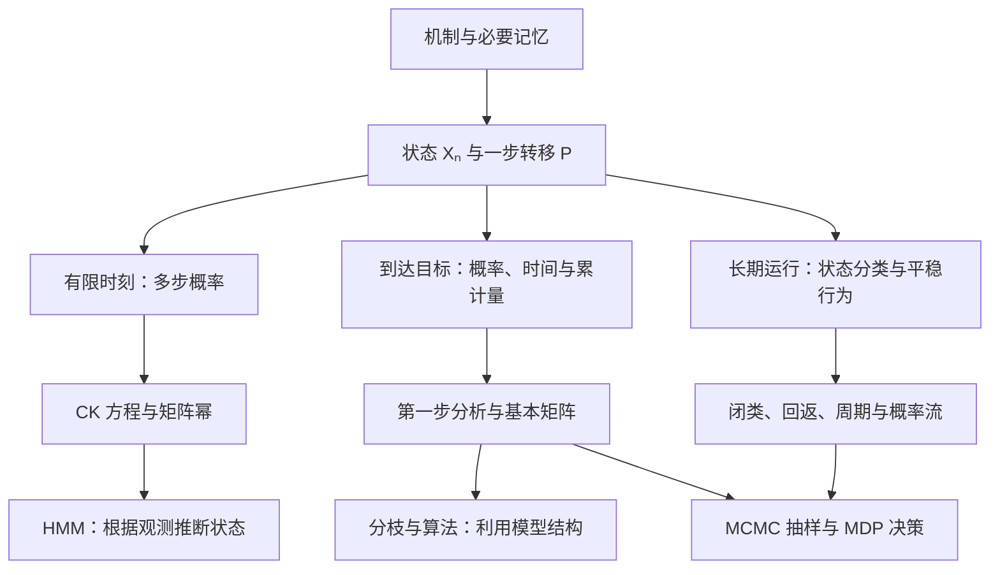
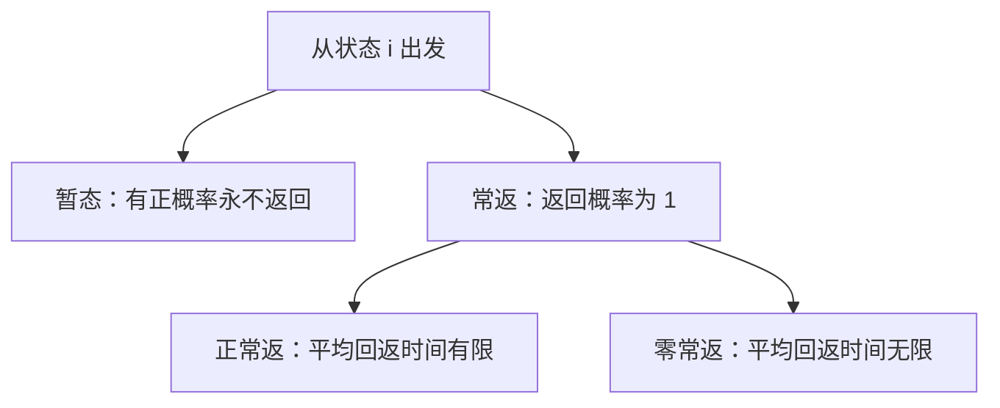

# 第四章总复习｜概念关系、逻辑地图与解题思路

> **范围**：Ross《Introduction to Probability Models》第 13 版，§4.1–4.11，结合本章四份讲解。中文负责解释，英文标记术语。
>
> **复习目标**：先分清概念在描述什么、彼此能推出什么，再看到题目就能判断“要求哪个量、该用什么方法、条件是否满足”。§4.1–4.8 着重掌握计算；§4.9–4.11 保持概览深度。
>
> **读法**：先读 **1.3、2.4、第 4 部分和 9.1**，理清概念关系；再按第 3–6 部分复习基本工具。第 7 部分用一道综合例题把它们串起来，第 8–10 部分补齐模型与应用，最后用第 11–12 部分复习方法与逻辑关系。

## 1. 整个第四章，到底在做什么？

### 1.1 一个核心思想：把未来需要的信息装进“当前状态”

现实中的系统会随时间变化：天气、资金、机器状态、种群规模、算法进度。整段历史可能很长，但预测下一步未必需要全部历史。

如果状态设计得合适，就能做到：

$$
P(X_{n+1}=j\mid X_n=i,\text{更早历史})
=P(X_{n+1}=j\mid X_n=i)=p_{ij}.
$$

这就是马尔可夫性质（Markov property）。本章主要研究转移概率不随时间改变的时间齐次链（time-homogeneous chain）。

**一旦把一步机制写成矩阵 $P$，本章就沿着三条路线展开：**

1. **未来某个时刻会怎样？** 从一步转移推到多步转移。
2. **到达某个目标之前会怎样？** 求命中概率、等待时间、累计访问次数。
3. **一直运行下去会怎样？** 判断常返性、时间占比、平稳分布与极限概率。

后面的分枝、可逆性、MCMC、MDP、HMM，都在这套框架上利用特殊结构，或者改变我们使用链的目的。

图中的线表示主要联系，不表示某个应用只能使用一种工具。例如 HMM 的递推还大量使用条件概率，MDP 也需要第一步分析。

### 1.2 各节在这张地图上的位置

| 教材部分          | 核心问题                   | 学完应当获得的能力             |
| ------------- | ---------------------- | --------------------- |
| **4.1 建模**    | 什么信息足够预测下一步？           | 设计状态、判断马尔可夫性、写转移矩阵    |
| **4.2 多步转移**  | $n$ 步之后在哪里？怎样处理“曾经发生”？ | 用 $P^n$；必要时扩充状态或改造吸收态 |
| **4.3 状态分类**  | 哪些状态互通？会不会回来？          | 识别类、闭类、常返与暂态          |
| **4.4 长期行为**  | 平均多久回来？长期占多少时间？概率是否收敛？ | 区分平稳分布、时间平均、逐时刻极限     |
| **4.5 应用**    | 先到哪个边界？到达要多久？          | 把文字问题变成递推与边界条件        |
| **4.6 暂态访问**  | 离开之前，每个暂态累计访问多少次？      | 用基本矩阵统一求访问量、时间和吸收概率   |
| **4.7 分枝过程**  | 人口如何增长？最终会不会灭绝？        | 条件期望、全方差、概率生成函数与固定点   |
| **4.8 时间可逆性** | 倒着看是什么链？概率流能否逐对平衡？     | 反向转移、细致平衡、快速求平稳分布     |
| **4.9 MCMC**  | 能否设计链来从目标分布抽样？         | 理解 MH、Gibbs 与平稳分布的联系  |
| **4.10 MDP**  | 行动可以改变转移时，怎样提高长期收益？    | 固定策略后分析链，比较或优化策略      |
| **4.11 HMM**  | 状态看不到，只能看到信号，怎么办？      | 区分滤波、平滑、预测与路径解码       |

**本章的共用方法，其实大多来自 Ch3：条件化、全概率、全期望、全方差。** 马尔可夫性使“条件化以后剩下的问题”只需用当前状态描述，因此可以反复使用同一种递推。

### 1.3 概念为什么容易混？先分清它在描述哪个层面

本章的术语有些描述**状态之间的连接**，有些描述**返回时间**，还有些描述**概率分布**。把它们放在同一层逐个背，很容易误以为其中一个会自动推出另一个。

| 层面        | 在问什么？                    | 相关概念                   |
| --------- | ------------------------ | ---------------------- |
| 预测需要的信息   | 给定当前状态后，还需要更早历史吗？        | 马尔可夫性（Markov property） |
| 状态之间的连接   | 能否走到？能否互相走到？进入后还能出去吗？    | 可达、互通、闭类、不可约           |
| 返回与等待     | 会不会回来？平均要等多久？            | 暂态、常返、正常返、零常返          |
| 返回的时间节律   | 可以在哪些步数回来？是否被固定节律限制？     | 周期、非周期                 |
| 分布与长期频率   | 分布是否不变？时间占比是多少？是否趋于同一分布？ | 平稳分布、长期比例、极限分布         |
| 平稳状态下的方向性 | 每对状态之间的正反概率流是否相等？        | 细致平衡、可逆性               |

其中，**正常返与零常返是常返的两种类型**；而**不可约、正常返、非周期是在回答不同的问题**。后面会看到，一条链可以同时“不可约、正常返、周期为 2”，这些性质并不冲突。

还要先分清三种经常被“规律不变”混在一起的说法：

| 概念 | 真正含义 | 不代表什么 |
|---|---|---|
| 马尔可夫性（Markov property） | 当前状态已包含预测下一步所需的信息 | 不代表相邻时刻独立 |
| 时间齐次性（time homogeneity） | 同一个 $p_{ij}$ 在不同时间都适用 | 不代表各时刻的状态分布相同 |
| 从平稳分布开始（stationary initialization） | $X_0\sim\pi$ 且 $\pi P=\pi$，之后始终有 $X_n\sim\pi$ | 不代表状态不动，也不代表各时刻独立 |

例如，天气每天使用同一个转移矩阵，所以时间齐次；若今天确定下雨，明天下雨概率为 $0.7$，边际分布已经改变，说明**固定转移规则仍可以产生变化的状态分布**。

之后看到一个概念，先问：“它在描述哪一层？”再判断与其他概念的关系。

---

## 2. 做题之前：先确定“状态”和“所求量”

### 2.1 状态怎么设计？先问这三个问题

**第一，什么时候观察？** 是抽球前还是放回后？维修前还是维修后？第 $n$ 次操作产生的观测，未必就是 $X_n$。

**第二，当前信息够不够？** 若两个历史有相同的当前状态，却给出不同的下一步分布，状态就记录得不够，需要状态扩充（state augmentation）。

**第三，有没有不必要的信息？** 状态应保留影响未来的区别；对于下一步规律完全相同的信息，可以考虑压缩。

| 情形 | 合适的状态思路 |
|---|---|
| 明天天气依赖最近两天 | 记录最近两天的组合 |
| 资金每次增减 1 | 记录当前资金 |
| 等待一个固定模式首次出现 | 记录“当前末尾与目标开头匹配的最长长度” |
| 每个个体独立产生同分布的后代 | 记录当前个体总数 |
| 下一步取决于剩余人数与队列顺序 | 记录所需角色与顺序，不能只记人数 |

关于模式匹配，失败后不一定清零。例如目标 HTH，已匹配 H 后又出现 H，仍保留一个 H 的进度。**应保留可作为下一轮起点的最长有效后缀。**

状态计数也取决于角色是否可区分。例如 $k$ 人比赛，若当前两名选手没有位置区别，其余人排队，候选状态数为

$$
\binom{k}{2}(k-2)!=\frac{k!}{2}.
$$

若把场上两人也按有区别的位置记录，则是 $k!$。但数完以后仍要验证：这些信息是否足够决定下一步。

### 2.2 转移矩阵的检查比“行和为 1”多一步

写清状态顺序后，对每个当前状态列出下一步所有互斥情形，再相加得到 $p_{ij}$。

$$
p_{ij}\ge0,\qquad \sum_jp_{ij}=1.
$$

除了检查行和，还要把一行翻译回原机制：**为什么这一行可以去这些状态，不能去其他状态？**

若想合并状态，一个常用的充分条件是：同一组内任意两个状态，转入每个新组的总概率都相同。这时合并后的下一步规律才能只取决于新状态。这叫可合并性（lumpability）。

### 2.3 四类问题必须分开

全文采用行向量分布，记初始分布为 $\alpha$，并约定

$$
P_i(\cdot)=P(\cdot\mid X_0=i),\qquad
E_i[\cdot]=E[\cdot\mid X_0=i].
$$

| 题目问什么 | 数学对象 | 首选方法 |
|---|---|---|
| 第 $n$ 步是否在 $j$ | $P_i(X_n=j)$ | 矩阵幂 |
| 是否会到达 $A$；先到 $A$ 还是 $B$ | 命中概率（hitting probability） | 第一步分析、吸收改造 |
| 平均多久到达；到达前累计访问多少次 | 首达时间、累计量 | 第一步分析、基本矩阵 |
| 长期有多少比例处于 $j$ | 长期比例（long-run proportion） | 类结构、平稳方程 |

最容易误用的是：

$$
P_i(X_n\in A)\quad\text{与}\quad P_i(T_A\le n).
$$

前者只看**最后在哪里**；后者看**此前是否来过**。原链可能到过 $A$ 又离开，所以两者通常不同。

### 2.4 同一个目标状态，也可以问六种不同的量

先统一时间记号：

$$
T_j=\inf\{n\ge0:X_n=j\},\qquad
T_j^+=\inf\{n\ge1:X_n=j\}.
$$

若从 $j$ 出发，$T_j=0$，而 $T_j^+$ 才是首次返回时间；若从 $i\ne j$ 出发，两种计时的首次到达时刻相同。永不到达或返回时，时间记为 $\infty$。

| 所求量 | 记号 | 看的是哪件事？ | 数值类型 |
|---|---|---|---|
| 一步转移概率（one-step transition probability） | $p_{ij}$ | 下一步就在 $j$ | $[0,1]$ 内的概率 |
| 多步转移概率（n-step transition probability） | $p_{ij}^{(n)}$ | 第 $n$ 步在 $j$，中途可反复来去 | $[0,1]$ 内的概率 |
| 未来命中概率（hitting probability） | $f_{ij}=P_i(T_j^+<\infty)$ | 未来至少到过一次 $j$ | $[0,1]$ 内的概率 |
| 平均首次命中时间（mean hitting time） | $E_iT_j$ | 从当前起点平均等多久才到 $j$ | 步数期望，可为 $\infty$ |
| 平均回返时间（mean recurrence time） | $E_jT_j^+$ | 从 $j$ 出发，平均多久再次在 $j$ | 步数期望，可为 $\infty$ |
| 暂态累计访问量（expected number of visits） | $N_{ij}$，见第 6 部分 | 累计在暂态 $j$ 出现几次，计入时刻 0 | 次数期望，可以大于 1 |

**概率回答“会不会”，时间回答“等多久”，访问量回答“出现几次”。** 同样看向状态 $j$，这三个答案的含义和单位完全不同。

特别注意：如果下一步仍在 $j$，就算一次长度为 1 的返回，**不要求先离开 $j$ 再回来**。这也是为什么平均回返时间可以小于 2。

而 $T_j$ 本身是随机变量，$E_iT_j$ 才是平均数。一次实现很快到达，与平均等待时间很长甚至无穷，并不矛盾。

---

## 3. 方法一：有限时刻用矩阵幂，历史事件先改造状态

### 3.1 为什么是 $P^n$？

对中间状态使用全概率公式，就得到 Chapman–Kolmogorov 方程（CK equations）：

$$
p_{ij}^{(m+n)}=\sum_kp_{ik}^{(m)}p_{kj}^{(n)}.
$$

这正是矩阵乘法，因此

$$
\boxed{p_{ij}^{(n)}=[P^n]_{ij},\qquad
\mathcal L(X_n)=\alpha P^n.}
$$

这里 $\mathcal L(X_n)$ 表示 $X_n$ 的分布。矩阵幂把所有中间路径的贡献都加起来，而 $(p_{ij})^n$ 通常没有这个含义。

若题目同时指定中间与最终状态，时间按区间拆分。例如 $0<m<n$：

$$
P_i(X_m=j,X_n=k)=p_{ij}^{(m)}p_{jk}^{(n-m)}.
$$

若要求最后落在一个集合，就对该集合中的终点求和。若起点随机，再对起点按 $\alpha$ 加权。

### 3.2 二状态题：用标量递推，常比算大矩阵幂快

例如

$$
P=\begin{pmatrix}0.7&0.3\\0.4&0.6\end{pmatrix}.
$$

令 $x_n=P(X_n=0)$，则

$$
x_{n+1}=0.7x_n+0.4(1-x_n)=0.4+0.3x_n.
$$

先求不动点 $x_*=0.4+0.3x_*$，得 $x_*=4/7$；再相减：

$$
x_{n+1}-\frac47=0.3\left(x_n-\frac47\right).
$$

所以

$$
\boxed{x_n=\frac47+\left(x_0-\frac47\right)(0.3)^n.}
$$

一个式子同时给出有限步概率和极限。技巧是：**先找固定值，再研究偏离固定值的部分。**

### 3.3 “在 $n$ 步内曾到达”：让目标变成吸收态

定义首次命中时间（first hitting time）

$$
T_A=\inf\{n\ge0:X_n\in A\}.
$$

若初始就在 $A$，则 $T_A=0$。下面假设从 $i\notin A$ 出发。

把 $A$ 设为吸收集合（absorbing set），使链一旦进去就不再出来。这个改造保留首次到达之前的路径，同时让“已经到过”在之后的状态中留下记录。

也可以只保留 $A$ 外的子矩阵

$$
Q=(p_{ij})_{i,j\notin A},
\qquad r_i=\sum_{j\in A}p_{ij}.
$$

它通常不是行和为 1 的转移矩阵，因为进入 $A$ 的概率被移出了矩阵。于是

$$
\boxed{
\begin{aligned}
P_i(T_A>n)&=(Q^n\mathbf1)_i,\\
P_i(T_A\le n)&=1-(Q^n\mathbf1)_i,\\
P_i(T_A=n)&=(Q^{n-1}r)_i,\qquad n\ge1.
\end{aligned}}
$$

三个公式对应三种事件：**活到第 $n$ 步仍未命中、此前已命中、恰好最后一步首次命中。**

这些有限步公式不要求最终一定到达 $A$。但若进一步要求 $(I-Q)^{-1}$，就必须检查是否确实是暂态部分。

---

## 4. 方法二：长期问题先看结构，再解平稳方程

### 4.1 为什么一定要先画正概率转移图？

矩阵里的正元素画成边。先用图回答“能不能走到”，再讨论概率与等待时间。

| 概念 | 描述谁？ | 精确含义 |
|---|---|---|
| 可达（accessible），$i\to j$ | 两个状态的单向关系 | 存在一条从 $i$ 到 $j$ 的正概率路径 |
| 互通（communicate），$i\leftrightarrow j$ | 两个状态的双向关系 | $i\to j$ 且 $j\to i$ |
| 互通类（communicating class） | 一组状态 | 彼此互通的最大状态组 |
| 闭类（closed class） | 一个互通类 | 类内不会转移到类外 |
| 不可约（irreducible） | 整条链 | 所有状态属于同一个互通类 |
| 吸收态（absorbing state） | 单个状态 $i$ | $p_{ii}=1$，到达后一直留在这里 |

它们的联系是：**先用双向可达划分互通类，再看每个类是否有出口；只有一个类时，整条链不可约。** 吸收态则是最简单的单状态闭类。

注意三个不等价：

- **可达不等于必然到达。** 若从 0 出发各以 $1/2$ 概率进入吸收态 $A,B$，则 0 可达 $A$，但到达 $A$ 的概率只有 $1/2$。
- **互通不等于闭类。** 两个状态可以互相到达，同时还存在一个再也回不来的出口。
- **闭类不等于吸收态。** 类内部可以有多个状态，进入后只是不离开这一组，仍然可以在组内移动。

接下来才能把连接结构与常返性联系起来：

| 逻辑关系 | 适用范围 |
|---|---|
| 常返互通类一定是闭类 | 有限或可数状态链 |
| 闭互通类一定正常返，其余状态暂态 | **有限链** |
| 有限且不可约，则全部状态正常返 | **有限链** |

有限链从任何起点出发，最终会进入某个闭类并留在其中。因此有限可约链的长期问题分两层：

> **先决定最终进入哪个闭类，再分析该闭类内部怎样分配时间。**

无限状态时，“闭”只表示不能走出这组状态，不妨碍一直走向组内更远的地方。例如整数上的有偏随机游走，整条链不可约、整个空间当然封闭，但每个状态仍然暂态。**无限链不能仅凭连通图判断回返性，转移概率的大小也很重要。**

### 4.2 常返与正常返是包含关系；周期是另一个维度

令 $f_i=P_i(T_i^+<\infty)$，$m_i=E_iT_i^+$。

先看 $f_i$：会不会回来？只有确认 $f_i=1$，才进一步用 $m_i$ 区分两种常返。

从状态 $i$ 出发，把“永不返回”的时间规定为 $\infty$，便有下表：

| 类型 | 返回概率 $f_i$ | 平均回返时间 $m_i$ | 一条轨迹中的访问情况 |
|---|---|---|---|
| 暂态（transient） | $<1$ | $\infty$ | 几乎必然只访问有限次 |
| 零常返（null recurrent） | $=1$ | $\infty$ | 几乎必然访问无穷次，但占用比例为 0 |
| 正常返（positive recurrent） | $=1$ | $<\infty$ | 几乎必然访问无穷次，占用比例为 $1/m_i>0$ |

这个表解释了两组容易混淆的推断：

- **平均回返时间无限，不一定是零常返。** 暂态也有无穷的无条件平均回返时间，只是原因是可能根本不回来。
- **长期比例为 0，不一定是暂态。** 暂态是访问次数最终有限；零常返是访问无穷次，但相对于总时间越来越稀疏。

对称整数随机游走是零常返的典型例子：每次最终都会回来，但少数非常长的等待足以让期望发散。“概率 1 会发生”与“平均等待有限”是两件事。

吸收态则满足 $T_i^+=1$，所以它一定正常返；反过来，正常返状态完全可以离开后再回来。

常返的另一个判据是

$$
\boxed{i\text{ 常返}\iff
\sum_{n=0}^{\infty}p_{ii}^{(n)}=\infty.}
$$

级数统计预期总访问次数。因此，$p_{ii}^{(n)}\to0$ 不能单独推出暂态：这是“某一个时刻的访问概率趋零”，但把所有时刻加起来仍可能发散。

**周期不参与上面三种回返类型的划分。** 它单独研究返回时刻的节律。

对存在回返路径的状态，周期（period）看返回可能发生在哪些步数：

$$
d(i)=\gcd\{n\ge1:p_{ii}^{(n)}>0\}.
$$

若 $d(i)=1$，称非周期（aperiodic）；若 $d(i)>1$，称周期（periodic）。同一互通类有相同的常返类型和周期。

判断周期的两个技巧：

- 类中有一个正概率自环，则该类非周期（aperiodic）。
- 没有自环也可能非周期，例如存在长度 2、3 的返回路径，最大公约数为 1。

不能把最短返回长度直接当成周期。也不要把非周期理解为“会回来”或“平均很快回来”：给零常返的对称随机游走加上原地停留，就变成了**非周期的零常返链**。

### 4.3 平稳分布、长期比例、极限概率：三个观察角度

| 对象 | 在问什么？ | 表达式 |
|---|---|---|
| 平稳分布（stationary distribution） | 哪个初始分布经过转移以后仍保持原样？ | $\pi P=\pi,\ \sum_j\pi_j=1,\ \pi_j\ge0$ |
| 长期比例（long-run proportion） | 沿一条轨迹，把很多时刻平均，各状态占多少时间？ | $L_j(N)=\frac1N\sum_{n=0}^{N-1}\mathbf1_{\{X_n=j\}}$ 的极限 |
| 极限概率（limiting probability） | 固定起点，看越来越晚的那个时刻，状态概率趋于什么？ | $\lim_{n\to\infty}p_{ij}^{(n)}$ |

可以想成三种观察方式：

- 平稳分布：**先把初始比例选对，检查之后是否一直不变。**
- 长期比例：**运行一次很久，统计时间频率。**
- 极限概率：**每次从同一起点重新运行，统计第 $n$ 步的状态，再让 $n$ 增大。**

它们在合适条件下数值相同，但定义不同。下面的关系明确以**不可约链**为讨论对象：

| 条件 | 可以得到什么？ | 此时还不能自动得到什么？ |
|---|---|---|
| 正常返 | 存在唯一平稳概率分布 $\pi$；反过来存在平稳概率分布也推出正常返 | 尚未保证从固定起点逐步收敛 |
| 正常返 | 从任意状态出发，$L_j(N)\to\pi_j$，几乎必然；且 $E_jT_j^+=1/\pi_j$ | 时间平均收敛不排除逐时刻振荡 |
| 正常返，并且非周期 | 从任意起点都有 $p_{ij}^{(n)}\to\pi_j$ | — |

因此，“正常返”与“非周期”各自负责不同的事情：前者保证可归一化的长期概率分布，后者使逐时刻分布不被周期性振荡阻碍。

按本教材的用语，遍历链（ergodic chain）就是

$$
\boxed{\text{不可约}+\text{正常返}+\text{非周期}.}
$$

它把三个不同维度的条件合在一起。**只求长期时间平均时，不必额外要求非周期。**

#### 一个反例，分开“保持不变”和“逐步趋近”

$$
P=\begin{pmatrix}0&1\\1&0\end{pmatrix}.
$$

这条交替链有限、不可约、正常返，但周期为 2。

- 若初始分布为 $(1/2,1/2)$，此后每个时刻仍为 $(1/2,1/2)$，所以它有平稳分布。
- 任取一条轨迹，0 与 1 各占一半时间，所以长期比例仍为 $(1/2,1/2)$。
- 若确定从 0 开始，第 $n$ 步在 0 的概率在 1、0 之间交替，所以没有逐步极限。

周期链的问题在于**不能保证任意初始状态都趋于平稳分布**，而不是说任何初始分布下都不可能保持平稳。

#### 两个边界，避免把条件记成错误的“当且仅当”

**有限链总有平稳分布，不可约保证唯一，但唯一不反推不可约。** 例如一个暂态最终流入一个吸收态，唯一平稳分布集中在吸收态，整条链仍然可约。有多个闭类时，平稳分布通常是各类平稳分布的混合；其与初始状态的关系见第 7 部分。

**每个极限概率都存在，也不一定组成概率分布。** 无限不可约的零常返链中，每个固定状态的概率可以都趋于 0，但这些 0 的总和是 0。这表示概率不断分散到更多状态，不能把“全零向量”称为平稳概率分布。

### 4.4 求平稳分布的标准流程

对有限不可约的 $m$ 状态链：

1. 列 $\pi_j=\sum_i\pi_i p_{ij}$。
2. 取 $m-1$ 条独立平衡方程，加上 $\sum_j\pi_j=1$。
3. 解出后检查非负性与归一化。
4. 若题目问极限，再判断周期；若问回返时间，使用 $1/\pi_j$。

两个快速识别：

- **二状态链**：若 $P=\begin{pmatrix}1-a&a\\b&1-b\end{pmatrix}$ 且 $a,b>0$，则 $\pi=(b/(a+b),a/(a+b))$。
- **有限双随机矩阵（doubly stochastic matrix）**：行和与列和都为 1，均匀分布是平稳分布。可逆性仍需另查。

无限链即使找到形式上的解，也要检查总和是否有限。不能归一化的“解”不是平稳概率分布。

### 4.5 求出 $\pi$ 以后，怎么把它变成题目要的答案？

下面在不可约正常返情形下使用；奖励还需可积，例如有界。

| 题目所求 | 计算方式 |
|---|---|
| 长期处于状态集合 $A$ 的比例 | $\sum_{i\in A}\pi_i$ |
| 每步平均成本／奖励，状态奖励为 $r_i$ | $\sum_i\pi_i r_i$ |
| 某种转移的长期频率 | 对相应边累加 $\pi_i p_{ij}$ |
| 转移奖励为 $c(i,j)$ 的长期平均奖励 | $\sum_{i,j}\pi_i p_{ij}c(i,j)$ |
| 从状态 $j$ 出发平均多久再次到 $j$ | $1/\pi_j$ |

例如机器处于“故障”的比例，与“每步发生一次新故障”的频率不同：

$$
\text{故障占比}=\sum_{j\in B}\pi_j,
\qquad
\text{新故障频率}=\sum_{i\notin B,\ j\in B}\pi_i p_{ij}.
$$

一次故障可能持续很多步，所以不能用故障占比代替故障发生率。若进入频率为正，平均每段故障持续时间可由“故障占比 ÷ 进入故障的频率”得到。

---

## 5. 方法三：到达问题统一用第一步分析

### 5.1 不知道怎么开始时，先定义“从 $i$ 出发还剩什么”

第一步分析（first-step analysis）的共同形式是：

$$
\boxed{\text{当前要求的量}
=\text{本步贡献}
+\text{第一步以后剩余量的条件平均}.}
$$

最重要的不是先写公式，而是把未知量定义准确。下面令 $A,B$ 为不相交的成功、失败边界；边界以外才使用递推。

| 求什么 | 未知量 | 内部递推 | 边界条件 |
|---|---|---|---|
| 先到 $A$ 而不是 $B$ 的概率 | $h_i=P_i(T_A<T_B)$ | $h_i=\sum_jp_{ij}h_j$ | $h=1$ 在 $A$；$h=0$ 在 $B$ |
| 到达目标集合 $A$ 的平均时间 | $t_i=E_iT_A$ | $t_i=1+\sum_jp_{ij}t_j$ | $t=0$ 在 $A$ |
| 到达 $A$ 前累计的状态费用 | $v_i=E_i[\sum_{n=0}^{T_A-1}c(X_n)]$ | $v_i=c(i)+\sum_jp_{ij}v_j$ | $v=0$ 在 $A$ |

概率没有“先花掉一步”的代价；时间有，所以多一个 $1$；累计费用则把 $1$ 换成当期费用。

若有“永不到达”的可能，概率递推取符合事件含义的最小非负解；时间可能为无穷，不能为了得到一个有限数硬解方程。有限状态且目标以概率 1 到达时，平均命中时间有限，有限线性方程通常可以直接使用。

### 5.2 三个很实用的简化

**自环移到左边。** 若求时间，

$$
(1-p_{ii})t_i
=1+\sum_{j\ne i}p_{ij}t_j.
$$

若删去原地停留，只观察真正移动的时刻，命中哪个边界的概率不变，但**时间单位改变了**。计算原来的等待时间时，必须把停留时间补回来。

**只求均值时，先试条件均值递推。** 若能得到

$$
E[X_{n+1}\mid X_n]=aX_n+b,
$$

就有 $E[X_{n+1}]=aE[X_n]+b$。不必先求完整的 $P^n$。酒店人数、分枝过程都体现了这个技巧。

**必须依次经过固定关卡时，分段。** 最近邻路径从 0 到 $N$ 必须经过 $1,\ldots,N-1$，可以拆成相邻到达时间。期望相加不需要独立；若要把方差也直接相加，需要说明各段独立，例如利用强马尔可夫性质（strong Markov property）。

### 5.3 模板例一：赌徒破产

资金取值 $0,\ldots,N$；每次以 $p$ 赢 1、以 $q=1-p$ 输 1，$0<p<1$；0 与 $N$ 吸收。

要求先到 $N$ 的概率，令 $h_i=P_i(T_N<T_0)$：

$$
h_i=ph_{i+1}+qh_{i-1},\qquad h_0=0,\ h_N=1.
$$

因为只与相邻状态有关，研究差分 $\Delta_i=h_i-h_{i-1}$：

$$
\Delta_{i+1}=\frac qp\Delta_i.
$$

等比求和后得到

$$
\boxed{
h_i=
\begin{cases}
\dfrac{1-(q/p)^i}{1-(q/p)^N},&p\ne q,\\[2mm]
\dfrac{i}{N},&p=q=1/2.
\end{cases}}
$$

若问到任一边界的平均时间，换成

$$
t_i=1+pt_{i+1}+qt_{i-1},\qquad t_0=t_N=0.
$$

公平情形的解是 $t_i=i(N-i)$。例如 $N=5,i=2$，成功概率为 $2/5$，平均结束时间为 6 步；两个答案来自不同的未知量与边界值。

**可迁移技巧**：相邻状态递推，优先尝试相邻差分；有两个边界，两个边界条件都要用。

### 5.4 模板例二：首次出现 HHH，为什么不能直接写 $2^3$？

公平独立抛硬币，状态记录当前末尾连续正面的个数 $0,1,2$；出现 HHH 后进入目标状态 3。

令 $t_i$ 为当前进度 $i$ 下，距离首次完成还要抛的次数：

$$
\begin{aligned}
t_0&=1+\tfrac12t_0+\tfrac12t_1,\\
t_1&=1+\tfrac12t_0+\tfrac12t_2,\\
t_2&=1+\tfrac12t_0,\qquad t_3=0.
\end{aligned}
$$

解得 $(t_0,t_1,t_2)=(14,12,8)$，所以从没有历史进度开始，平均等待 **14 次**。

而 $1/P(\mathrm{HHH})=8$ 表示：把连续三个结果组成窗口状态后，从一次 HHH 出现开始，到下一次 HHH 出现的平均间隔。此时已经有可重叠的历史，起点与“从零开始等待”不同。

**通用做法**：模式题先画匹配进度，不要直接套“模式概率的倒数”。这既能处理重叠，也能避免等待时间与回返时间混淆。

### 5.5 §4.5 的算法应用：抓住模型，不必背故事

| 模型 | 建模与递推 | 需要记住的结论 |
|---|---|---|
| 随机下降到更优排名 | 在 $i>1$ 时等概率到 $1,\ldots,i-1$；$t_i=1+\frac1{i-1}\sum_{j<i}t_j$ | $t_N=H_{N-1}$，约为 $\log N$ |
| 0 处强制走到 1 的反射游走 | 内部以 $p$ 向右、$q$ 向左；求到 $N$ 的时间 | 公平时从 0 出发均值为 $N^2$ |
| 2-SAT 随机翻转 | 与某个满足赋值相同的变量数，每步增加的条件概率至少 $1/2$ | 可用公平反射游走控制求解时间 |

随机下降模型还可把步数写成“哪些较小排名被访问过”的指标变量之和，因此能求均值与方差；它不意味着真实的单纯形算法自动具有同样的运行时间。

反射游走中，对固定 $p$，到 $N$ 的期望时间在 $p>1/2$ 时为线性量级，在 $p=1/2$ 时为 $N^2$，在 $p<1/2$ 时为指数级。**小的方向偏差，可能造成巨大的运行时间差别。**

对有满足解的 $n$ 变量 2-SAT，可得到 $E[T]\le n^2$。利用马尔可夫不等式（Markov's inequality）：

$$
P(T>2n^2)\le\frac{E[T]}{2n^2}\le\frac12.
$$

独立重启 $r$ 次，每次运行 $2n^2$ 步，全部失败的概率至多 $2^{-r}$。这里“不成功”是概率事件，不能据一次失败逻辑地证明无解。

> **复习提醒**：公平反射游走的分段虽独立，不能仅凭这一点就断言总时间渐近正态；随机占优也不能直接推出方差占优。此处用均值与上面的概率界分析随机算法即可。

### 5.6 随机游走扩展：边界与空间大小先于公式

| 空间与运动规律 | 结论 |
|---|---|
| $\mathbb Z$ 上独立的对称 $\pm1$ 步 | 零常返 |
| $\mathbb Z$ 上独立的有偏 $\pm1$ 步，$p\ne1/2$ | 暂态 |
| $\mathbb Z^d$ 上每步等概率选择 $2d$ 个最近邻方向 | $d=1,2$ 零常返；$d\ge3$ 暂态 |
| 有限连通网格上构成不可约链 | 正常返 |
| 有限区域设吸收边界 | 求退出位置、退出时间，用边界递推 |

第三行是 Pólya 常返定理（Pólya recurrence theorem）的标准情形。其直觉是偶数步回原点概率的量级为 $n^{-d/2}$；把这些概率求和，发散与收敛的分界就在二维和三维之间。

若每步以固定概率 $0<r<1$ 原地停留，其余按原游走移动，得到懒惰游走（lazy random walk）：常返类型不变，但自环消除了周期。**在一、二维加自环，仍不能把零常返变成正常返。**

---

## 6. 方法四：基本矩阵把第一步分析一次做完

### 6.1 为什么会出现一个逆矩阵？

现在考虑有限链，把全部暂态组成集合 $\mathcal T$，暂态之间的转移子矩阵记为 $Q$。

定义基本矩阵（fundamental matrix）

$$
N_{ij}=E_i\left[\sum_{n=0}^{\infty}\mathbf1_{\{X_n=j\}}\right],
\qquad i,j\in\mathcal T.
$$

它是从 $i$ 出发对 $j$ 的累计访问次数期望，**包含时刻 0**。

每个时刻的访问概率相加，或者对第一步条件化，分别给出

$$
\boxed{N=I+Q+Q^2+\cdots=(I-Q)^{-1}.}
$$

这不是一套独立于第一步分析的新理论。它就是 $N=I+QN$ 的矩阵解。

教材 §4.6 使用 $P_T,S$ 记号，对应这里的 $Q,N$。

可以这样区分三个矩阵：**$P$ 描述完整的一步转移；$Q$ 只保留暂态之间的一步转移；$N$ 累加所有时刻的访问概率。** 所以 $N$ 不是转移矩阵，元素可以大于 1，行和也不要求等于 1。

### 6.2 一个 $N$ 可以回答四类问题

若把每个闭类合并为一个吸收类别，令 $R_{ia}$ 为暂态 $i$ 下一步进入类别 $a$ 的概率，则

| 所求量 | 公式 | 为什么 |
|---|---|---|
| 从 $i$ 出发累计访问暂态 $j$ 几次 | $N_{ij}$ | 定义本身 |
| 离开全部暂态的平均时间 | $t=N\mathbf1$ | 离开前每个时刻都贡献一次暂态访问 |
| 离开前的累计状态费用 | $v=Nc$ | 各状态的访问量乘每次费用 |
| 最终进入各吸收类别的概率 | $H=NR$ | 每次暂态访问都有相应的出口概率 |

用统一的方程看，更容易记：

$$
(I-Q)t=\mathbf1,\qquad
(I-Q)v=c,\qquad
(I-Q)H=R.
$$

**左边描述同一套“继续在暂态中走”的机制；右边只是换成不同的本步贡献。**

只求一个起点对应的某个量时，直接解所需的线性方程就可以，不一定要把整个逆矩阵都算出来。

### 6.3 访问次数怎样转成“曾经到达”的概率？

对暂态 $i,j$，记 $f_{ij}=P_i(X_n=j\text{ 对某个 }n\ge1)$。则

$$
\boxed{
f_{ij}=
\begin{cases}
N_{ij}/N_{jj},&i\ne j,\\[1mm]
1-1/N_{jj},&i=j.
\end{cases}}
$$

从不同状态出发时，先要到过 $j$，到达后平均贡献 $N_{jj}$ 次访问，所以 $N_{ij}=f_{ij}N_{jj}$。从 $j$ 本身出发时，必须先扣除时刻 0 的一次访问。

这也解释为什么“访问次数期望大于 1”和“命中概率小于 1”可以同时成立。

### 6.4 逆矩阵能用之前，先问一句

**所选状态真的会全部离开吗？**

若把一个闭类也放进 $Q$，$I-Q$ 可能不可逆。若目标只是指定状态 $A$，却有正概率进入别的闭类、从此到不了 $A$，那么

$$
P_i(T_A=\infty)>0\quad\Longrightarrow\quad E_iT_A=\infty.
$$

“离开暂态的时间”与“到达某个指定目标的时间”，必须根据出口是否都指向目标来区分。

---

## 7. 一道综合例题：把分类、平稳、吸收和时间全部串起来

按状态 $0,1,2,3,4$ 排列，给定

$$
P=
\begin{pmatrix}
1/2&1/4&1/4&0&0\\
1/4&1/2&0&0&1/4\\
0&0&1/2&1/2&0\\
0&0&1/2&1/2&0\\
0&0&0&0&1
\end{pmatrix}.
$$

从状态 0 出发，分别研究长期去向、平均等待时间与极限分布。

### 第一步：先分类，不急着计算 $P^n$

- $\{0,1\}$ 互通，但可以流向外部且无法返回，因此是暂态类。
- $C=\{2,3\}$ 是闭互通类，内部正常返。
- $\{4\}$ 是吸收类。
- 两个闭类都有自环，非周期。

因此最终只可能：**进入 $C$，或者被状态 4 吸收。**

### 第二步：抽出暂态部分，求一个小逆矩阵

$$
Q=\begin{pmatrix}1/2&1/4\\1/4&1/2\end{pmatrix},
\qquad
N=(I-Q)^{-1}
=\begin{pmatrix}8/3&4/3\\4/3&8/3\end{pmatrix}.
$$

立刻得到：

- 从 0 出发，平均访问 0 共 $8/3$ 次，访问 1 共 $4/3$ 次。
- 平均离开暂态需要 $8/3+4/3=4$ 步。
- 曾到达暂态 1 的概率为 $(4/3)/(8/3)=1/2$。
- 未来返回 0 的概率为 $1-1/(8/3)=5/8$。

这四个量不同，但都来自同一个 $N$。

### 第三步：确定最终进入哪个闭类

把 $C$ 视为一个出口、4 视为另一个出口，则

$$
R=\begin{pmatrix}1/4&0\\0&1/4\end{pmatrix},
\qquad
H=NR=
\begin{pmatrix}2/3&1/3\\1/3&2/3\end{pmatrix}.
$$

因此从 0 出发，最终进入 $C$ 的概率为 $2/3$，进入 4 的概率为 $1/3$。

如果只想求第一个概率，也可直接设 $h_i=P_i(T_C<T_{\{4\}})$，列

$$
h_0=\tfrac12h_0+\tfrac14h_1+\tfrac14,\qquad
h_1=\tfrac14h_0+\tfrac12h_1.
$$

同样得到 $h_0=2/3$。**基本矩阵与第一步方程是同一件事的两种写法。**

### 第四步：把“进入概率”与“类内平稳比例”结合

类 $C$ 内的平稳分布为 $(1/2,1/2)$；进入 4 后一直留在 4。所以从 0 出发：

$$
\boxed{
\lim_{n\to\infty}P_0(X_n=\cdot)
=(0,0,1/3,1/3,1/3).
}
$$

例如最后在状态 2 的概率，是“进入 $C$ 的概率 $2/3$”乘“类内分给 2 的比例 $1/2$”。

整条可约链的平稳分布却不是唯一的，而是一族：

$$
\pi=(0,0,\lambda/2,\lambda/2,1-\lambda),
\qquad 0\le\lambda\le1.
$$

**平稳方程本身不知道你从哪里出发；初始状态通过进入各闭类的概率，确定实际极限中的权重。**

### 第五步：用两个追问检查是否真正理解

**追问一：一条轨迹长期是否在 2、3、4 各占 $1/3$？**

不是。从 0 出发，单条轨迹最终只选中一个闭类：

- 以概率 $2/3$ 进入 $C$，此后时间占比为 $(0,0,1/2,1/2,0)$。
- 以概率 $1/3$ 进入 4，时间占比为 $(0,0,0,0,1)$。

$(0,0,1/3,1/3,1/3)$ 是跨实验的概率分布极限；单次实验的长期时间比例具有随机性。

**追问二：到达状态 4 的平均时间是否也等于 4？**

不是。4 步是离开全部暂态的平均时间；但有 $2/3$ 的概率永远不到达状态 4，所以 $E_0T_{\{4\}}=\infty$。

同理，从状态 2 出发的平均返回时间应在类 $C$ 内计算，为 $1/(1/2)=2$。不能随意拿全链某个混合平稳分布中的 $\pi_2=1/3$，反推为 3。

### 从例子提炼：有限可约链的通用路线

1. 分互通类，找全部闭类。
2. 各闭类内部求自己的平稳分布。
3. 对暂态求最终进入每个闭类的概率。
4. 若所有可达闭类非周期，用“进入权重 × 类内平稳分布”求逐时刻极限。
5. 问单条轨迹的长期比例时，记住它最终只进入其中一个闭类。

这条路线比直接计算整个大矩阵的高次幂更清楚，也能解释答案为什么依赖初始状态。

---

## 8. 专门结构一：分枝过程把“对一步条件化”变成“对一代条件化”

### 8.1 为什么不直接写无限大的转移矩阵？

分枝过程（branching process）中，每个个体独立产生后代，单个个体的后代数为 $Z$。记

$$
P(Z=k)=p_k,\qquad E[Z]=\mu,\qquad
\operatorname{Var}(Z)=\sigma^2.
$$

若本代有 $X_n$ 人，下一代就是 $X_n$ 个独立后代数之和。与其展开每个转移概率，不如先给定 $X_n$：

$$
E[X_{n+1}\mid X_n]=\mu X_n,\qquad
\operatorname{Var}(X_{n+1}\mid X_n)=\sigma^2X_n.
$$

若初始有确定的 $m$ 个祖先，所用矩有限，则

$$
\boxed{
E[X_n]=m\mu^n,\qquad
v_{n+1}=\mu^2v_n+\sigma^2E[X_n],\quad v_0=0,
}
$$

其中 $v_n=\operatorname{Var}(X_n)$。

方差的两项分别来自：**本代人数本身在波动**，以及**每个人的后代数在波动**。这正是全方差公式（law of total variance）。

**做矩的题：先算条件均值与条件方差，再用全期望、全方差递推。**

### 8.2 灭绝问题要换成“所有后代家族都灭绝”

定义概率生成函数（probability generating function, PGF）

$$
G(s)=E[s^Z]=\sum_{k=0}^{\infty}p_ks^k.
$$

从一个祖先开始，设最终灭绝概率为 $q$。若第一代有 $k$ 个孩子，整个种群灭绝需要 $k$ 个独立家族全部灭绝，概率为 $q^k$。所以

$$
\boxed{q=G(q),\qquad q\text{ 是 }[0,1]\text{ 内最小的根}.}
$$

为什么取最小根？从 $q_0=0$ 开始迭代 $q_{n+1}=G(q_n)$，得到截至第 $n+1$ 代已灭绝的概率。它单调趋于最终灭绝概率，并且不会超过任何非负固定点。

解题顺序：

1. 算 $\mu=G'(1)$，先判断亚临界、临界或超临界。
2. 若需要，解 $G(q)=q$，在 $[0,1]$ 中取最小根。
3. 初始有 $m$ 个独立祖先时，最终灭绝概率为 $q^m$。

| 后代均值 | 名称 | 灭绝结论 |
|---|---|---|
| $\mu<1$ | 亚临界（subcritical） | $q=1$ |
| $\mu=1$ | 临界（critical） | 除了 $P(Z=1)=1$ 的退化情形，$q=1$ |
| $\mu>1$ | 超临界（supercritical） | $q<1$，但一般仍可能灭绝 |

例如 $p_0=1/4,p_1=1/4,p_2=1/2$，则 $\mu=5/4$，灭绝方程的根为 $1/2,1$，应取 $q=1/2$。三个祖先的灭绝概率为 $(1/2)^3=1/8$。

**期望增长与必然存活不是一回事。** 临界非退化分枝过程可以保持 $E[X_n]=1$，却最终几乎必然灭绝；少数尚未灭绝的路径有较大的人口，从而维持均值。

再联系状态分类：若 $p_0>0$，0 为吸收态，每个正整数状态都有正概率下一代直接灭绝，因此都是暂态。它是无限状态链；存活时可以向越来越大的人数逃离，不适用“有限链最终进入某个闭类”的结论。

---

## 9. 专门结构二：反向链与细致平衡，让长期计算更容易

### 9.1 从平稳条件下的 Bayes 公式出发

设链不可约正常返，平稳分布为 $\pi$，并从平稳分布开始观察。反向转移概率（reversed transition probability）是

$$
\boxed{
\widehat p_{ij}
=P(X_{n-1}=j\mid X_n=i)
=\frac{\pi_jp_{ji}}{\pi_i}.
}
$$

分子是“之前在 $j$、随后到 $i$”的联合概率；分母是现在位于 $i$ 的概率。反向矩阵不是 $P^{-1}$，一般也不是 $P^\mathsf T$。

若 $\widehat P=P$，链称为时间可逆（time reversible）。等价条件为细致平衡（detailed balance）：

$$
\boxed{\pi_i p_{ij}=\pi_j p_{ji}.}
$$

这几个概念的层次要分清：

| 概念 | 条件或含义 | 与其他概念的关系 |
|---|---|---|
| 反向链（reversed chain） | 在平稳状态下，把观察顺序倒过来，转移矩阵为 $\widehat P$ | 反向链可以定义，不表示它与原链相同 |
| 全局平衡（global balance） | $\pi_j=\sum_i\pi_i p_{ij}$ | 加上概率归一化，就是平稳分布的条件 |
| 细致平衡（detailed balance） | $\pi_i p_{ij}=\pi_j p_{ji}$，对所有状态对成立 | 每一对状态的正反概率流相等，比全局平衡更强 |
| 时间可逆（time reversible） | $\widehat P=P$ | 在上述平稳设定下，等价于细致平衡 |

为什么细致平衡能推出平稳？对 $i$ 求和：

$$
\sum_i\pi_i p_{ij}
=\sum_i\pi_j p_{ji}
=\pi_j.
$$

所以**细致平衡加归一化足以得到平稳分布；平稳分布未必满足细致平衡**，因为总流量平衡时，仍可能有绕环流动的净概率流。

细致平衡比较的是 $\pi_i p_{ij}$，也不要求 $p_{ij}=p_{ji}$。例如前面的天气链中 $p_{01}=0.3,\ p_{10}=0.4$，但

$$
\frac47\times0.3=\frac37\times0.4,
$$

所以仍然可逆。

**可逆性与非周期性也不能互相推出。** 第 4 部分的交替链可逆但周期为 2；下面的三状态偏向环非周期，却不可逆。可逆性检查方向上的对称，非周期性检查时间上的节律。

### 9.2 做可逆题的两条路线

**要找平稳分布：** 尝试用细致平衡求各状态权重的比值，再归一化，并检查所有非零边。

**要否定可逆性：** 优先找一条没有反向边的正概率边，或找一个环路，使顺、逆方向的概率乘积不同。

对于环 $i_0,i_1,\ldots,i_m=i_0$，可逆链必须满足

$$
\prod_{r=0}^{m-1}p_{i_r i_{r+1}}
=
\prod_{r=0}^{m-1}p_{i_{r+1} i_r}.
$$

一个反例环就能否定；要据环路证明可逆，则需要覆盖足够的环路关系，不能随意只检查一个环。

例如三状态环中，顺时针每步概率 $0.8$、逆时针 $0.2$。均匀分布平稳，但两个方向的三步环概率分别为 $0.8^3$、$0.2^3$，不相等，所以不可逆。它同时存在长度 2、3 的返回路径，故非周期；因此它还说明：**分布能够收敛，也不代表链可逆。**

### 9.3 看到哪些结构，可以快速求解？

| 结构 | 关键关系 | 结果或方法 |
|---|---|---|
| 生灭链（birth–death chain），只在相邻状态间移动 | $\pi_i a_i=\pi_{i+1}b_{i+1}$ | 顺着相邻比值推出全部权重，再归一化 |
| 有限连通无向加权图 | $w_{ij}=w_{ji}$，$d_i=\sum_jw_{ij}$ | $\pi_i=d_i/\sum_kd_k$ |
| Ehrenfest 球罐，$M$ 个球每步随机选一球换罐 | 向上概率 $(M-i)/M$，向下概率 $i/M$ | $\pi_i=\binom Mi2^{-M}$ |
| 自组织列表中相邻元素交换 | 比较这次交换与反向交换的概率流 | 局部相邻关系代替枚举全部排列 |
| 灯泡寿命更新，年龄为 $i=1,2,\ldots$ | 倒看时年龄递减，更新处重新选择寿命 | 有限平均寿命时 $\pi_i=P(L\ge i)/E[L]$ |

其中生灭链的具体权重为

$$
w_0=1,\qquad
w_i=\prod_{k=0}^{i-1}\frac{a_k}{b_{k+1}},
\qquad
\pi_i=\frac{w_i}{\sum_jw_j},
$$

这里 $a_k=p_{k,k+1}$，$b_{k+1}=p_{k+1,k}$，相关相邻概率为正。无限链还需检查 $\sum_jw_j<\infty$。

图上的普通随机游走，平稳概率正比于度数（degree）；只有正则图才得到均匀分布。Ehrenfest 模型虽然可逆，却有周期 2，从固定起点出发的逐时刻分布不能直接声称收敛到上述二项分布。

灯泡例还说明：**不可逆的链也可以通过反向机制帮助求平稳分布。** 反向分析是一种工具，可逆性是一个更特殊的性质。

---

## 10. 最后三节：把同一套理论用于抽样、决策与推断

先分清它们与普通马尔可夫链的关系：

| 名称 | 主要改变了什么？ | 目标 |
|---|---|---|
| 普通马尔可夫链（Markov chain） | 给定状态与转移规律 $P$ | 分析系统如何演化 |
| MCMC | 主动设计 $P$，让目标分布成为平稳分布 | 抽样与估计期望 |
| MDP | 加入行动，让行动影响转移与收益 | 选择好的决策策略 |
| HMM | 真实状态不可见，只能看到由状态产生的信号 | 根据观测推断隐藏状态 |

MCMC 是使用链的一类抽样方法，MDP 是可控制的决策模型，HMM 是带隐藏状态与观测机制的模型；它们不构成一条“由低级到高级”的概念层级。

### 10.1 §4.9 MCMC：以前给定 $P$ 求 $\pi$，现在给定 $\pi$ 设计 $P$

马尔可夫链蒙特卡洛（Markov chain Monte Carlo, MCMC）用于目标分布难以直接抽样的情形。

设计一条以目标分布为平稳分布的链，在满足相应遍历与可积条件时，用沿链采样的平均值估计目标期望。这里样本通常相关。

若目标分布只知道相对权重 $\pi(i)\propto b(i)$，MH 算法先按提议概率 $q(i,j)$ 选候选，再以

$$
\alpha(i,j)=\min\left\{1,\frac{b(j)q(j,i)}{b(i)q(i,j)}\right\}
$$

接受；拒绝则留在原状态。这一选择保证目标分布满足细致平衡，且未知的归一化常数消掉了。

| 方法 | 核心动作 |
|---|---|
| Metropolis–Hastings | 提议候选，再用接受率修正提议偏好 |
| Gibbs sampling | 固定其他分量，从一个分量的条件分布抽样；对应候选接受率为 1 |

做基础题时：写出提议、算接受率、写实际转移、检查平衡。还要保证实际链能遍历目标支持集；“平稳分布正确”不自动意味着任何起点都能有效探索。

拒绝后的重复状态也必须计入样本。只保留成功移动，会改变时间占比，通常改变所估计的分布。

### 10.2 §4.10 MDP：先固定策略，再研究它诱导的链

马尔可夫决策过程（Markov decision process, MDP）中，行动 $a$ 会改变转移概率 $P_{ij}(a)$，也带来奖励 $R(i,a)$。

若平稳策略（stationary policy）为 $\beta_i(a)$，即处于 $i$ 时选择 $a$ 的概率，则

$$
\boxed{P_{ij}^{\beta}=\sum_a\beta_i(a)P_{ij}(a).}
$$

所以评价给定策略的方法仍是：

> **由策略算转移矩阵 → 求该链的平稳比例 → 计算长期平均奖励。**

这里“平稳策略”与“平稳分布”中的平稳描述不同对象：**策略 $\beta_i(a)$ 不随时间改变，是选择规则固定；状态分布平稳，是各状态的概率经过转移仍不变。** 固定策略之后，状态分布仍可能经历一个变化的过程。

在课本的遍历假设下，若状态平稳分布为 $\mu$，定义状态—行动占用比例（state-action occupancy measure）

$$
x_{ia}=\mu_i\beta_i(a).
$$

长期平均奖励为 $\sum_{i,a}x_{ia}R(i,a)$。最优策略可以通过最大化这个线性目标，配合以下约束来寻找：

$$
x_{ia}\ge0,\qquad
\sum_{i,a}x_{ia}=1,\qquad
\sum_ax_{ja}=\sum_{i,a}x_{ia}P_{ij}(a).
$$

最后由 $\beta_i(a)=x_{ia}/\sum_bx_{ib}$ 还原策略。这是线性规划（linear programming）。

在课本的有限、无额外约束设定下，存在一个确定性最优策略；若另有限制某状态的时间占比等约束，最优策略可能需要随机化。

**它与 §4.4 的联系**：平稳方程描述长期概率如何分配；MDP 进一步选择行动，改变这种分配，让收益更高。

### 10.3 MDP 后补充：RL / TD 只需记住这条联系

MDP 是决策问题的数学框架。强化学习（reinforcement learning, RL）利用交互或已有经验，学习价值和策略；模型可以未知，也可以先从数据中估计。

以折扣回报评价策略时，时序差分（temporal-difference learning, TD）的基本更新为

$$
\delta_t=r_{t+1}+\gamma V(s_{t+1})-V(s_t),
\qquad
V(s_t)\leftarrow V(s_t)+\eta\delta_t.
$$

$\gamma$ 是折扣因子（discount factor），$\eta$ 是学习率（learning rate）。它把“一步实际奖励 + 下一状态估值”作为新目标，用来修正当前估值。

**MDP 描述问题，RL 从经验学习，TD 是学习价值的一类方法。** TD(0) 评价一个策略不等于自动找到最优策略；这里使用的折扣回报，也不同于课本 MDP 的长期平均奖励标准。

### 10.4 §4.11 HMM：状态没有变成可见，只是观测提供了信息

隐马尔可夫模型（hidden Markov model, HMM）中：

- 隐藏状态 $X_t$ 按 $P$ 转移。
- 观测 $Y_t$ 由当前状态产生，发射概率（emission probability）为 $e_j(y)=P(Y_t=y\mid X_t=j)$。
- 给定当前隐藏状态后，当前观测与其余状态和观测条件独立。

设初始分布为 $\nu$，观测为 $y_1,\ldots,y_T$。前向量（forward quantity）为

$$
F_t(j)=P(Y_{1:t}=y_{1:t},X_t=j).
$$

它递推为

$$
\boxed{
F_1(j)=\nu_j e_j(y_1),\qquad
F_t(j)=e_j(y_t)\sum_iF_{t-1}(i)p_{ij}.
}
$$

读成“先按状态转移预测，再乘观测似然”。将 $F_t$ 归一化就得到当前状态的后验分布。

后向量（backward quantity）

$$
B_t(i)=P(Y_{t+1:T}=y_{t+1:T}\mid X_t=i)
$$

满足 $B_T(i)=1$，以及

$$
B_t(i)=\sum_jp_{ij}e_j(y_{t+1})B_{t+1}(j).
$$

**后向算法不等于反向链。** 后向算法是从观测序列末端往前递推条件概率；反向链是把随机过程的观察顺序倒过来，研究新的转移规律。HMM 的后向算法不要求隐藏链可逆。

最后按题目目标选择输出：

| 问题 | 计算方式 |
|---|---|
| 观测序列的概率，即似然（likelihood） | $\sum_jF_T(j)$ |
| 截至 $t$ 的观测下，当前状态是什么：滤波（filtering） | $F_t(j)/\sum_iF_t(i)$ |
| 利用全部观测，回头判断过去状态：平滑（smoothing） | $F_t(j)B_t(j)/\sum_iF_t(i)B_t(i)$ |
| 预测下一状态 | 当前滤波后验再乘 $P$ |
| 预测下一观测 | 对预测的下一状态按其概率加权，再混合各状态的发射分布 |
| 最可能的整条路径：解码（decoding） | Viterbi 最大值递推并回溯 |

Viterbi 将前向算法中的“求和”改为“取最大值”：

$$
D_1(j)=\nu_j e_j(y_1),\qquad
D_t(j)=e_j(y_t)\max_i\{D_{t-1}(i)p_{ij}\}.
$$

其中 $D_t(j)$ 保留“以 $j$ 结尾的最佳隐藏路径”与前 $t$ 个观测的联合概率。每一步记录最佳前驱，最后反向回溯。逐时刻分别选后验概率最大的状态，通常得到不同于这条最佳路径的结果。

**HMM 的宏观联系**：CK 对看不见的中间状态求和；Bayes 根据观测更新判断；动态规划让历史信息通过少量递推量传下去。

---

## 11. 把方法变成做题习惯

### 11.1 读题后，先按关键词定位

| 题目中的关键信息 | 先用什么 | 下笔前检查什么 |
|---|---|---|
| “第 $n$ 步”“第 $n$ 次操作后” | $P^n$ 或低维递推 | 初始状态、观察时点、事件对应哪些状态 |
| “截至 $n$ 曾经”“恰好首次” | 吸收改造、$Q^n$ | 累计事件还是首次事件 |
| “先达到……还是……” | 命中概率递推 | 成功边界为 1，失败边界为 0 |
| “平均还要多少步” | $t=1+Pt$ 的边界版本 | 是否能几乎必然到达；起点是否已在目标 |
| “累计访问次数”“退出前总费用” | 基本矩阵 $N$ | 所选集合是否真正暂态；是否计入时刻 0 |
| “长期比例”“稳态”“极限” | 类结构与平稳方程 | 是否可约；是否还需非周期 |
| “每单位时间发生几次” | 概率流 $\pi_i p_{ij}$ | 统计状态占比还是转移事件 |
| “每个个体独立产生后代” | 条件矩或 PGF | 问人口均值还是最终灭绝 |
| “倒看”“可逆”“无向图”“相邻转移” | Bayes、细致平衡 | 平衡所有边；最后归一化 |
| “只见信号”“最可能状态或路径” | HMM 递推 | 要滤波、平滑，还是整条路径 |

### 11.2 最常见的失分点，集中检查一次

1. **把条件概率当无条件概率。** $p_{ij}^{(n)}$ 给定起点；随机起点要乘初始分布。
2. **把“可达”当“必到”。** 存在正概率路径，不保证命中概率为 1。
3. **把有限链结论用于无限链。** 无限不可约链可以暂态，也可以零常返。
4. **平稳分布求出来就直接写极限。** 还需检查周期；可约链还需确定闭类权重。
5. **第一步方程忘掉边界。** 概率的成功边界为 1，时间的目标边界为 0。
6. **把首次命中与首次返回混淆。** 从 $j$ 出发，$T_{\{j\}}=0$，但 $T_j^+\ge1$。
7. **删掉自环以后，仍把一步当原来的一步。** 命中概率可能不变，等待时间需要修正。
8. **求基本矩阵时包含常返类。** 先做状态分类，再提取 $Q$。
9. **把细致平衡当成所有链都满足的性质。** 平稳不推出可逆；均匀平稳也不推出可逆。
10. **灭绝方程见到根 1 就结束。** 需要取 $[0,1]$ 内最小根。

### 11.3 计算结果怎样快速自查？

**概率检查**：是否在 $[0,1]$？各互斥且穷尽的最终去向概率是否加起来为 1？

**边界检查**：起点已在目标时，首次命中时间应为 0；已在成功边界时，成功概率应为 1。

**方向检查**：赌徒的胜率提高后，先到上边界的概率是否提高？向目标漂移增强后，平均到达时间是否降低？

**量纲检查**：概率、步数、访问次数、每步收益不能混用。访问次数可以大于 1，概率不能。

**结构检查**：闭类不能流出；暂态不能获得正的平稳质量；不可约正常返链的平稳概率应全部为正。

**回代检查**：解出 $\pi$ 后验算 $\pi P=\pi$；解出 $t$ 后回代第一步方程。比只核对最终小数更可靠。

### 11.4 教材里较多的应用，分别在训练什么？

| 应用类别 | 可迁移的方法 |
|---|---|
| 天气、球箱、保险等级 | 用一步随机机制写矩阵；确定观察时点 |
| 遗传、酒店、人员流动 | 找不变量或分布封闭性，猜平稳分布再验证 |
| 设备故障与长期成本 | 状态比例对应时间占比，边流量对应事件频率 |
| 模式等待、赌徒破产、随机算法 | 编码目标、设边界、第一步递推 |
| Aloha 拥塞模型 | 局部有成功机会不保证整体长期稳定 |
| 随机游走中的停止与无穷和 | 几乎必然会停止不保证平均时间有限；交换期望与无穷和需要条件 |
| 图、球罐、列表、灯泡年龄 | 从局部对称或反向机制寻找平稳关系 |

复习应用时，先说出“这个故事在使用哪种方法”，再看具体参数。这样更容易把旧题方法迁移到新题。

---

## 12. 最后总结：把这一章记成一套分析流程

### 12.1 五句话串起整个单元

**第一，设计状态。** 把预测未来需要的历史放进当前状态，用 $P$ 写出一步机制。

**第二，辨认所求量。** 有限时刻的概率、命中概率、等待时间、累计量与长期占比，使用不同的表达式。

**第三，用条件化建立关系。** CK 是对中间状态条件化；第一步分析是对下一步条件化；分枝是对本代人数或第一代后代数条件化；HMM 是对隐藏状态条件化。

**第四，用结构减少计算。** 类与闭类决定长期去向，相邻转移适合差分，暂态适合基本矩阵，对称与反向机制适合细致平衡。

**第五，核对使用条件。** 有限还是无限、不可约还是可约、正常返与否、是否非周期、边界如何规定，决定一个公式是否适用。

### 12.2 真正值得形成的三个联系

**矩阵幂与基本矩阵：**

$$
P^n\text{ 看某个时刻；}\qquad
I+Q+Q^2+\cdots\text{ 把到达前的各个时刻累加。}
$$

**首次到达与长期比例：**

首次到达描述“从这里出发要等多久”；回返周期反复出现后，平均回返时间的倒数给出类内长期比例。两者相连，但起点和计时方式不同。

**平稳理论与后三种应用：**

MCMC 用平稳理论设计抽样；MDP 用行动改变长期收益；HMM 用观测推断不可见的状态。它们都建立在前面的状态、转移与条件化之上。

### 12.3 概念关系速查：箭头成立，需要什么条件？

| 要记住的关系 | 不能遗漏的条件或区别 |
|---|---|
| 吸收态 $\Rightarrow$ 正常返 $\Rightarrow$ 常返 | 两个箭头一般都不能反推 |
| 互通类闭 $\Rightarrow$ 正常返 | **有限**闭互通类才能直接用这条结论 |
| 平稳概率分布存在 $\Longleftrightarrow$ 正常返 | 此处讨论**不可约**链 |
| 不可约 + 正常返 $\Rightarrow$ 唯一平稳分布、长期时间比例 | 不要求非周期；仍可能逐时刻振荡 |
| 再加非周期 $\Rightarrow$ 从任意起点逐步收敛到 $\pi$ | 按本教材，这三个条件合起来称遍历 |
| 细致平衡 + 归一化 $\Rightarrow$ 平稳分布 | 平稳不反推细致平衡；可逆也不保证非周期 |

再用四个问题防止记混：

- **能走到，还是一定会到？** 可达只保证一条正概率路径。
- **会回来，还是平均回来得够快？** 常返只保证返回概率为 1。
- **分布一直不变，还是从别的起点逐渐趋近？** 分别对应平稳与收敛。
- **总流量平衡，还是每对状态都平衡？** 分别对应全局平衡与细致平衡。

### 12.4 建议的复习顺序

1. **先读 1.3，再独立复述第 4 部分的概念关系**：区分连接结构、回返类型、周期与分布行为。
2. **遮住答案重做第 7 部分综合例题**：自己分闭类、求 $N$、求去向权重、写极限，并解释两个追问。
3. **独立列出赌徒破产、HHH、分枝灭绝的方程**。列式比背结果更重要。
4. **用第 11 部分给题目分类**，每题先写“目标量 + 适用条件 + 方程”，再计算。
5. **最后复述 MCMC、MDP、HMM 的用途**，区分抽样、决策、推断即可。

当你能从文字题里自己定义状态与目标量，并说明为什么选择这个方程时，这一章的知识就已经从“零散公式”变成可以使用的方法。

---

**教材定位**：§4.1–4.3，页 201–223；§4.4–4.5，页 223–252；§4.6–4.8，页 253–269；§4.9–4.11，页 269–283。多维随机游走和 MDP → RL / TD 延续前面的补充；五状态综合例题用于串联方法，并非教材原题。
