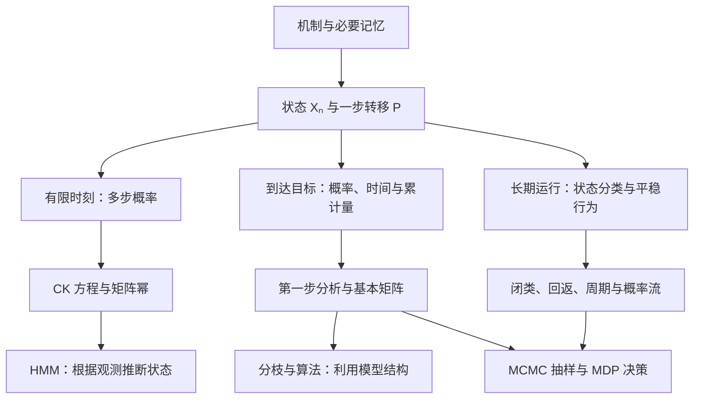
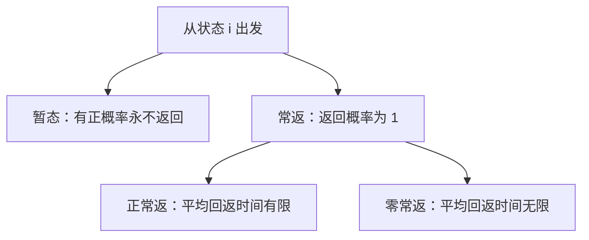

# 第四章总复习｜马尔可夫链的逻辑主线、概念关系与解题框架

> **范围**：Ross《Introduction to Probability Models》第 4 章 §4.1–4.11，结合你提供的 4.1–4.3、4.4–4.5、4.6–4.8、4.9–4.11 四份讲解以及教材。
>
> **符号原则**：核心符号尽量沿用教材。特别是一步转移概率用 $P_{ij}$，$n$ 步转移概率用 $P_{ij}^{n}$；§4.6 使用 $P_T,S=(s_{ij})$；§4.7 使用后代概率 $P_j$ 与灭绝概率 $\pi_0$；§4.8 的反向转移矩阵使用 $Q=(Q_{ij})$；§4.10 使用 $P_{ij}(a),\beta_i(a),\pi_{ia},R(i,a)$；§4.11 使用 $S_n,F_n(j),B_k(i),V_k(j)$。
>
> **复习目标**：不是把本章记成一串定义和公式，而是形成“状态怎么设计 → 当前到底求什么量 → 用哪一种条件化或长期结构 → 公式需要什么条件”的完整分析流程。§4.1–4.8 重点掌握计算与条件，§4.9–4.11 重点掌握模型目的、核心机制和关键递推。

## 1. 整个第四章，到底在做什么？

### 1.1 一个核心思想：把未来需要的信息装进“当前状态”

现实中的系统会随时间变化：天气、资金、机器状态、种群规模、算法进度。整段历史可能很长，但预测下一步未必需要全部历史。

如果状态设计得合适，就能做到：

$$
P(X_{n+1}=j\mid X_n=i,\text{更早历史})
=P(X_{n+1}=j\mid X_n=i)=P_{ij}.
$$

这就是马尔可夫性质（Markov property）。本章主要研究转移概率不随时间改变的时间齐次链（time-homogeneous chain）。

**一旦把一步机制写成矩阵 $P$，本章就沿着三条路线展开：**

1. **未来某个时刻会怎样？** 从一步转移推到多步转移。
2. **到达某个目标之前会怎样？** 求命中概率、等待时间、累计访问次数。
3. **一直运行下去会怎样？** 判断常返性、时间占比、平稳分布与极限概率。

后面的分枝、可逆性、MCMC、MDP、HMM，都在这套框架上利用特殊结构，或者改变我们使用链的目的。



图中的线表示主要联系，不表示某个应用只能使用一种工具。例如 HMM 的递推还大量使用条件概率，MDP 也需要第一步分析。

### 1.2 各节在这张地图上的位置

| 教材部分          | 核心问题                   | 学完应当获得的能力             |
| ------------- | ---------------------- | --------------------- |
| **4.1 建模**    | 什么信息足够预测下一步？           | 设计状态、判断马尔可夫性、写转移矩阵    |
| **4.2 多步转移**  | $n$ 步之后在哪里？怎样处理“曾经发生”？ | 用 $P^n$；历史事件必要时通过扩充状态或吸收改造处理 |
| **4.3 状态分类**  | 哪些状态互通？会不会回来？          | 识别类、闭类、常返与暂态          |
| **4.4 长期行为**  | 平均多久回来？长期占多少时间？概率是否收敛？ | 区分平稳分布、时间平均、逐时刻极限     |
| **4.5 应用**    | 先到哪个边界？到达要多久？          | 把文字问题变成递推与边界条件        |
| **4.6 暂态访问**  | 离开之前，每个暂态累计访问多少次？      | 用教材基本矩阵 $S$ 统一求暂态访问量与退出时间   |
| **4.7 分枝过程**  | 人口如何增长？最终会不会灭绝？        | 条件期望、全方差、概率生成函数与固定点   |
| **4.8 时间可逆性** | 倒着看是什么链？概率流能否逐对平衡？     | 反向矩阵 $Q$、细致平衡、环路判据与快速求平稳分布     |
| **4.9 MCMC**  | 能否设计链来从目标分布抽样？         | 理解 MH、Gibbs 与平稳分布的联系  |
| **4.10 MDP**  | 行动可以改变转移时，怎样提高长期收益？    | 固定策略后分析链，比较或优化策略      |
| **4.11 HMM**  | 状态看不到，只能看到信号，怎么办？      | 区分滤波、平滑、预测与路径解码       |

**本章的共用方法，其实大多来自 Ch3：条件化、全概率、全期望、全方差。** 马尔可夫性使“条件化以后剩下的问题”只需用当前状态描述，因此可以反复使用同一种递推。

### 1.3 先统一教材符号：同一个字母在不同小节可能会被重复使用

这一章最容易造成混乱的地方之一，是不同小节会重复使用某些字母。因此应当**在每个小节内部按教材含义解释符号**，不要跨小节机械套用。

| 范围 | 教材核心符号 | 含义 |
|---|---|---|
| §4.1–4.5 | $P_{ij}$ | 从状态 $i$ 一步转移到状态 $j$ 的概率 |
| §4.2 | $P_{ij}^{n}$ | 从 $X_0=i$ 出发，经过 $n$ 步处于 $j$ 的概率；$P^n=(P_{ij}^{n})$ |
| 初始分布 | $\alpha_i=P\{X_0=i\}$ | 初始时刻位于状态 $i$ 的概率 |
| §4.4 | $\pi_i,\ m_i$ | 状态 $i$ 的长期比例／平稳概率；平均回返时间 |
| §4.6 | $P_T,\ s_{ij},\ S$ | 暂态子矩阵；从 $i$ 出发在暂态 $j$ 的平均总停留次数；基本矩阵 |
| §4.7 | $P_j,\ \mu,\ \sigma^2,\ \pi_0$ | 单个个体产生 $j$ 个后代的概率；后代均值、方差；最终灭绝概率 |
| §4.8 | $Q_{ij}$ | 平稳链倒着观察时的反向转移概率 |
| §4.9 | $Q=(q(i,j)),\ \alpha(i,j),\ \pi(j)$ | Proposal 转移矩阵；接受概率；目标平稳概率 |
| §4.10 | $P_{ij}(a),\ \beta_i(a),\ \pi_{ia},\ R(i,a)$ | 采取动作 $a$ 后的转移；策略；状态—动作长期比例；奖励 |
| §4.11 | $S_n,\ p(s\mid j),\ F_n(j),\ B_k(i),\ V_k(j)$ | 观测信号；发射概率；Forward、Backward、Viterbi 递推量 |

两个特别容易误会的地方：

1. **§4.8 和 §4.9 都出现 $Q$，但含义不同。** §4.8 的 $Q$ 是反向链；§4.9 的 $Q=(q(i,j))$ 是人为选取的 Proposal 链。
2. **§4.7 的 $\pi_0$ 是“分枝过程最终灭绝概率”，不是某个普通状态的平稳概率。** 这是教材在不同语境下复用符号，必须靠上下文判断。

因此本总结后面尽量不再自行更换这些核心符号。

### 1.4 概念为什么容易混？先分清它在描述哪个层面

本章的术语有些描述**状态之间的连接**，有些描述**返回时间**，还有些描述**概率分布**。把它们放在同一层逐个背，很容易误以为其中一个会自动推出另一个。

| 层面        | 在问什么？                    | 相关概念                   |
| --------- | ------------------------ | ---------------------- |
| 预测需要的信息   | 给定当前状态后，还需要更早历史吗？        | 马尔可夫性（Markov property） |
| 状态之间的连接   | 能否走到？能否互相走到？进入后还能出去吗？    | 可达、互通、闭类、不可约           |
| 返回与等待     | 会不会回来？平均要等多久？            | 暂态、常返、正常返、零常返          |
| 返回的时间节律   | 可以在哪些步数回来？是否被固定节律限制？     | 周期、非周期                 |
| 分布与长期频率   | 分布是否不变？时间占比是多少？是否趋于同一分布？ | 平稳分布、长期比例、极限分布         |
| 平稳状态下的方向性 | 每对状态之间的正反概率流是否相等？        | 细致平衡、可逆性               |

其中，**正常返与零常返是常返的两种类型**；而**不可约、正常返、非周期是在回答不同的问题**。后面会看到，一条链可以同时“不可约、正常返、周期为 2”，这些性质并不冲突。

还要先分清三种经常被“规律不变”混在一起的说法：

| 概念 | 真正含义 | 不代表什么 |
|---|---|---|
| 马尔可夫性（Markov property） | 当前状态已包含预测下一步所需的信息 | 不代表相邻时刻独立 |
| 时间齐次性（time homogeneity） | 同一个 $P_{ij}$ 在不同时间都适用 | 不代表各时刻的状态分布相同 |
| 从平稳分布开始（stationary initialization） | $X_0\sim\pi$ 且 $\pi P=\pi$，之后始终有 $X_n\sim\pi$ | 不代表状态不动，也不代表各时刻独立 |

例如，天气每天使用同一个转移矩阵，所以时间齐次；若今天确定下雨，明天下雨概率为 $0.7$，边际分布已经改变，说明**固定转移规则仍可以产生变化的状态分布**。

之后看到一个概念，先问：“它在描述哪一层？”再判断与其他概念的关系。

---

## 2. 做题之前：先确定“状态”和“所求量”

### 2.1 状态怎么设计？先问这三个问题

**第一，什么时候观察？** 是抽球前还是放回后？维修前还是维修后？第 $n$ 次操作产生的观测，未必就是 $X_n$。

**第二，当前信息够不够？** 若两个历史有相同的当前状态，却给出不同的下一步分布，状态就记录得不够，需要状态扩充（state augmentation）。

**第三，有没有不必要的信息？** 状态应保留影响未来的区别；对于下一步规律完全相同的信息，可以考虑压缩。

| 情形 | 合适的状态思路 |
|---|---|
| 明天天气依赖最近两天 | 记录最近两天的组合 |
| 资金每次增减 1 | 记录当前资金 |
| 等待一个固定模式首次出现 | 记录“当前末尾与目标开头匹配的最长长度” |
| 每个个体独立产生同分布的后代 | 记录当前个体总数 |
| 下一步取决于剩余人数与队列顺序 | 记录所需角色与顺序，不能只记人数 |

关于模式匹配，失败后不一定清零。例如目标 HTH，已匹配 H 后又出现 H，仍保留一个 H 的进度。**应保留可作为下一轮起点的最长有效后缀。**

状态计数也取决于角色是否可区分。例如 $k$ 人比赛，若当前两名选手没有位置区别，其余人排队，候选状态数为

$$
\binom{k}{2}(k-2)!=\frac{k!}{2}.
$$

若把场上两人也按有区别的位置记录，则是 $k!$。但数完以后仍要验证：这些信息是否足够决定下一步。

### 2.2 转移矩阵的检查比“行和为 1”多一步

写清状态顺序后，对每个当前状态列出下一步所有互斥情形，再相加得到 $P_{ij}$。

$$
P_{ij}\ge0,\qquad \sum_jP_{ij}=1.
$$

除了检查行和，还要把一行翻译回原机制：**为什么这一行可以去这些状态，不能去其他状态？**

若想合并状态，一个常用的充分条件是：同一组内任意两个状态，转入每个新组的总概率都相同。这时合并后的下一步规律才能只取决于新状态。这叫可合并性（lumpability）。

### 2.3 四类问题必须分开

全文采用行向量分布，记初始分布为 $\alpha$，并约定

$$
P_i(\cdot)=P(\cdot\mid X_0=i),\qquad
E_i[\cdot]=E[\cdot\mid X_0=i].
$$

| 题目问什么 | 数学对象 | 首选方法 |
|---|---|---|
| 第 $n$ 步是否在 $j$ | $P_i(X_n=j)$ | 矩阵幂 |
| 是否会到达 $A$；先到 $A$ 还是 $B$ | 命中概率（hitting probability） | 第一步分析、吸收改造 |
| 平均多久到达；到达前累计访问多少次 | 首达时间、累计量 | 第一步分析、基本矩阵 |
| 长期有多少比例处于 $j$ | 长期比例（long-run proportion） | 类结构、平稳方程 |

最容易误用的是：

$$
P_i(X_n\in A)\quad\text{与}\quad P_i(T_A\le n).
$$

前者只看**最后在哪里**；后者看**此前是否来过**。原链可能到过 $A$ 又离开，所以两者通常不同。

### 2.4 同一个目标状态，也可以问六种不同的量

先统一时间记号：

$$
T_j=\inf\{n\ge0:X_n=j\},\qquad
T_j^+=\inf\{n\ge1:X_n=j\}.
$$

若从 $j$ 出发，$T_j=0$，而 $T_j^+$ 才是首次返回时间；若从 $i\ne j$ 出发，两种计时的首次到达时刻相同。永不到达或返回时，时间记为 $\infty$。

| 所求量 | 记号 | 看的是哪件事？ | 数值类型 |
|---|---|---|---|
| 一步转移概率（one-step transition probability） | $P_{ij}$ | 下一步就在 $j$ | $[0,1]$ 内的概率 |
| 多步转移概率（n-step transition probability） | $P_{ij}^{n}$ | 第 $n$ 步在 $j$，中途可反复来去 | $[0,1]$ 内的概率 |
| 未来命中概率（hitting probability） | $f_{ij}=P_i(T_j^+<\infty)$ | 未来至少到过一次 $j$ | $[0,1]$ 内的概率 |
| 平均首次命中时间（mean hitting time） | $E_iT_j$ | 从当前起点平均等多久才到 $j$ | 步数期望，可为 $\infty$ |
| 平均回返时间（mean recurrence time） | $E_jT_j^+$ | 从 $j$ 出发，平均多久再次在 $j$ | 步数期望，可为 $\infty$ |
| 暂态累计访问量（expected number of visits） | $N_{ij}$，见第 6 部分 | 累计在暂态 $j$ 出现几次，计入时刻 0 | 次数期望，可以大于 1 |

**概率回答“会不会”，时间回答“等多久”，访问量回答“出现几次”。** 同样看向状态 $j$，这三个答案的含义和单位完全不同。

特别注意：如果下一步仍在 $j$，就算一次长度为 1 的返回，**不要求先离开 $j$ 再回来**。这也是为什么平均回返时间可以小于 2。

而 $T_j$ 本身是随机变量，$E_iT_j$ 才是平均数。一次实现很快到达，与平均等待时间很长甚至无穷，并不矛盾。

---

## 3. 方法一：有限时刻用矩阵幂，历史事件先改造状态

### 3.1 为什么是 $P^n$？

对中间状态使用全概率公式，就得到 Chapman–Kolmogorov 方程（CK equations）：

$$
P_{ij}^{m+n}=\sum_kP_{ik}^{m}P_{kj}^{n}.
$$

这正是矩阵乘法，因此

$$
\boxed{P_{ij}^{n}=[P^n]_{ij},\qquad
\mathcal L(X_n)=\alpha P^n.}
$$

这里 $\mathcal L(X_n)$ 表示 $X_n$ 的分布。矩阵幂把所有中间路径的贡献都加起来，而 $(P_{ij})^n$ 通常没有这个含义。

若题目同时指定中间与最终状态，时间按区间拆分。例如 $0<m<n$：

$$
P_i(X_m=j,X_n=k)=P_{ij}^{m}P_{jk}^{(n-m)}.
$$

若要求最后落在一个集合，就对该集合中的终点求和。若起点随机，再对起点按 $\alpha$ 加权。

### 3.2 二状态题：用标量递推，常比算大矩阵幂快

例如

$$
P=\begin{pmatrix}0.7&0.3\\0.4&0.6\end{pmatrix}.
$$

令 $x_n=P(X_n=0)$，则

$$
x_{n+1}=0.7x_n+0.4(1-x_n)=0.4+0.3x_n.
$$

先求不动点 $x_*=0.4+0.3x_*$，得 $x_*=4/7$；再相减：

$$
x_{n+1}-\frac47=0.3\left(x_n-\frac47\right).
$$

所以

$$
\boxed{x_n=\frac47+\left(x_0-\frac47\right)(0.3)^n.}
$$

一个式子同时给出有限步概率和极限。技巧是：**先找固定值，再研究偏离固定值的部分。**

### 3.3 “在 $n$ 步内曾到达”：让目标变成吸收态

定义首次命中时间（first hitting time）

$$
T_A=\inf\{n\ge0:X_n\in A\}.
$$

若初始就在 $A$，则 $T_A=0$。下面假设从 $i\notin A$ 出发。

把 $A$ 设为吸收集合（absorbing set），使链一旦进去就不再出来。这个改造保留首次到达之前的路径，同时让“已经到过”在之后的状态中留下记录。

也可以只保留 $A$ 外的子矩阵

$$
Q=(P_{ij})_{i,j\notin A},
\qquad r_i=\sum_{j\in A}P_{ij}.
$$

它通常不是行和为 1 的转移矩阵，因为进入 $A$ 的概率被移出了矩阵。于是

$$
\boxed{
\begin{aligned}
P_i(T_A>n)&=(Q^n\mathbf1)_i,\\
P_i(T_A\le n)&=1-(Q^n\mathbf1)_i,\\
P_i(T_A=n)&=(Q^{n-1}r)_i,\qquad n\ge1.
\end{aligned}}
$$

三个公式对应三种事件：**活到第 $n$ 步仍未命中、此前已命中、恰好最后一步首次命中。**

这些有限步公式不要求最终一定到达 $A$。但若进一步要求 $(I-P_T)^{-1}$，就必须检查是否确实是暂态部分。

---

## 4. 方法二：长期问题先看结构，再解平稳方程

### 4.1 为什么一定要先画正概率转移图？

矩阵里的正元素画成边。先用图回答“能不能走到”，再讨论概率与等待时间。

| 概念 | 描述谁？ | 精确含义 |
|---|---|---|
| 可达（accessible），$i\to j$ | 两个状态的单向关系 | 存在一条从 $i$ 到 $j$ 的正概率路径 |
| 互通（communicate），$i\leftrightarrow j$ | 两个状态的双向关系 | $i\to j$ 且 $j\to i$ |
| 互通类（communicating class） | 一组状态 | 彼此互通的最大状态组 |
| 闭类（closed class） | 一个互通类 | 类内不会转移到类外 |
| 不可约（irreducible） | 整条链 | 所有状态属于同一个互通类 |
| 吸收态（absorbing state） | 单个状态 $i$ | $P_{ii}=1$，到达后一直留在这里 |

它们的联系是：**先用双向可达划分互通类，再看每个类是否有出口；只有一个类时，整条链不可约。** 吸收态则是最简单的单状态闭类。

注意三个不等价：

- **可达不等于必然到达。** 若从 0 出发各以 $1/2$ 概率进入吸收态 $A,B$，则 0 可达 $A$，但到达 $A$ 的概率只有 $1/2$。
- **互通不等于闭类。** 两个状态可以互相到达，同时还存在一个再也回不来的出口。
- **闭类不等于吸收态。** 类内部可以有多个状态，进入后只是不离开这一组，仍然可以在组内移动。

接下来才能把连接结构与常返性联系起来：

| 逻辑关系 | 适用范围 |
|---|---|
| 常返互通类一定是闭类 | 有限或可数状态链 |
| 闭互通类一定正常返，其余状态暂态 | **有限链** |
| 有限且不可约，则全部状态正常返 | **有限链** |

有限链从任何起点出发，最终会进入某个闭类并留在其中。因此有限可约链的长期问题分两层：

> **先决定最终进入哪个闭类，再分析该闭类内部怎样分配时间。**

无限状态时，“闭”只表示不能走出这组状态，不妨碍一直走向组内更远的地方。例如整数上的有偏随机游走，整条链不可约、整个空间当然封闭，但每个状态仍然暂态。**无限链不能仅凭连通图判断回返性，转移概率的大小也很重要。**

### 4.2 常返与正常返是包含关系；周期是另一个维度

令 $f_i=P_i(T_i^+<\infty)$，$m_i=E_iT_i^+$。

先看 $f_i$：会不会回来？只有确认 $f_i=1$，才进一步用 $m_i$ 区分两种常返。



从状态 $i$ 出发，把“永不返回”的时间规定为 $\infty$，便有下表：

| 类型 | 返回概率 $f_i$ | 平均回返时间 $m_i$ | 一条轨迹中的访问情况 |
|---|---|---|---|
| 暂态（transient） | $<1$ | $\infty$ | 几乎必然只访问有限次 |
| 零常返（null recurrent） | $=1$ | $\infty$ | 几乎必然访问无穷次，但占用比例为 0 |
| 正常返（positive recurrent） | $=1$ | $<\infty$ | 几乎必然访问无穷次，占用比例为 $1/m_i>0$ |

这个表解释了两组容易混淆的推断：

- **平均回返时间无限，不一定是零常返。** 暂态也有无穷的无条件平均回返时间，只是原因是可能根本不回来。
- **长期比例为 0，不一定是暂态。** 暂态是访问次数最终有限；零常返是访问无穷次，但相对于总时间越来越稀疏。

对称整数随机游走是零常返的典型例子：每次最终都会回来，但少数非常长的等待足以让期望发散。“概率 1 会发生”与“平均等待有限”是两件事。

吸收态则满足 $T_i^+=1$，所以它一定正常返；反过来，正常返状态完全可以离开后再回来。

常返的另一个判据是

$$
\boxed{i\text{ 常返}\iff
\sum_{n=0}^{\infty}P_{ii}^{n}=\infty.}
$$

级数统计预期总访问次数。因此，$P_{ii}^{n}\to0$ 不能单独推出暂态：这是“某一个时刻的访问概率趋零”，但把所有时刻加起来仍可能发散。

**周期不参与上面三种回返类型的划分。** 它单独研究返回时刻的节律。

对存在回返路径的状态，周期（period）看返回可能发生在哪些步数：

$$
d(i)=\gcd\{n\ge1:P_{ii}^{n}>0\}.
$$

若 $d(i)=1$，称非周期（aperiodic）；若 $d(i)>1$，称周期（periodic）。同一互通类有相同的常返类型和周期。

判断周期的两个技巧：

- 类中有一个正概率自环，则该类非周期（aperiodic）。
- 没有自环也可能非周期，例如存在长度 2、3 的返回路径，最大公约数为 1。

不能把最短返回长度直接当成周期。也不要把非周期理解为“会回来”或“平均很快回来”：给零常返的对称随机游走加上原地停留，就变成了**非周期的零常返链**。

### 4.3 平稳分布、长期比例、极限概率：三个观察角度

| 对象 | 在问什么？ | 表达式 |
|---|---|---|
| 平稳分布（stationary distribution） | 哪个初始分布经过转移以后仍保持原样？ | $\pi P=\pi,\ \sum_j\pi_j=1,\ \pi_j\ge0$ |
| 长期比例（long-run proportion） | 沿一条轨迹，把很多时刻平均，各状态占多少时间？ | $L_j(N)=\frac1N\sum_{n=0}^{N-1}\mathbf1_{\{X_n=j\}}$ 的极限 |
| 极限概率（limiting probability） | 固定起点，看越来越晚的那个时刻，状态概率趋于什么？ | $\lim_{n\to\infty}P_{ij}^{n}$ |

可以想成三种观察方式：

- 平稳分布：**先把初始比例选对，检查之后是否一直不变。**
- 长期比例：**运行一次很久，统计时间频率。**
- 极限概率：**每次从同一起点重新运行，统计第 $n$ 步的状态，再让 $n$ 增大。**

它们在合适条件下数值相同，但定义不同。下面的关系明确以**不可约链**为讨论对象：

| 条件 | 可以得到什么？ | 此时还不能自动得到什么？ |
|---|---|---|
| 正常返 | 存在唯一平稳概率分布 $\pi$；反过来存在平稳概率分布也推出正常返 | 尚未保证从固定起点逐步收敛 |
| 正常返 | 从任意状态出发，$L_j(N)\to\pi_j$，几乎必然；且 $E_jT_j^+=1/\pi_j$ | 时间平均收敛不排除逐时刻振荡 |
| 正常返，并且非周期 | 从任意起点都有 $P_{ij}^{n}\to\pi_j$ | — |

因此，“正常返”与“非周期”各自负责不同的事情：前者保证可归一化的长期概率分布，后者使逐时刻分布不被周期性振荡阻碍。

按本教材的用语，遍历链（ergodic chain）就是

$$
\boxed{\text{不可约}+\text{正常返}+\text{非周期}.}
$$

它把三个不同维度的条件合在一起。**只求长期时间平均时，不必额外要求非周期。**

#### 一个反例，分开“保持不变”和“逐步趋近”

$$
P=\begin{pmatrix}0&1\\1&0\end{pmatrix}.
$$

这条交替链有限、不可约、正常返，但周期为 2。

- 若初始分布为 $(1/2,1/2)$，此后每个时刻仍为 $(1/2,1/2)$，所以它有平稳分布。
- 任取一条轨迹，0 与 1 各占一半时间，所以长期比例仍为 $(1/2,1/2)$。
- 若确定从 0 开始，第 $n$ 步在 0 的概率在 1、0 之间交替，所以没有逐步极限。

周期链的问题在于**不能保证任意初始状态都趋于平稳分布**，而不是说任何初始分布下都不可能保持平稳。

#### 两个边界，避免把条件记成错误的“当且仅当”

**有限链总有平稳分布，不可约保证唯一，但唯一不反推不可约。** 例如一个暂态最终流入一个吸收态，唯一平稳分布集中在吸收态，整条链仍然可约。有多个闭类时，平稳分布通常是各类平稳分布的混合；其与初始状态的关系见第 7 部分。

**每个极限概率都存在，也不一定组成概率分布。** 无限不可约的零常返链中，每个固定状态的概率可以都趋于 0，但这些 0 的总和是 0。这表示概率不断分散到更多状态，不能把“全零向量”称为平稳概率分布。

### 4.4 求平稳分布的标准流程

对有限不可约的 $m$ 状态链：

1. 列 $\pi_j=\sum_i\pi_i P_{ij}$。
2. 取 $m-1$ 条独立平衡方程，加上 $\sum_j\pi_j=1$。
3. 解出后检查非负性与归一化。
4. 若题目问极限，再判断周期；若问回返时间，使用 $1/\pi_j$。

两个快速识别：

- **二状态链**：若 $P=\begin{pmatrix}1-a&a\\b&1-b\end{pmatrix}$ 且 $a,b>0$，则 $\pi=(b/(a+b),a/(a+b))$。
- **有限双随机矩阵（doubly stochastic matrix）**：行和与列和都为 1，均匀分布是平稳分布。可逆性仍需另查。

无限链即使找到形式上的解，也要检查总和是否有限。不能归一化的“解”不是平稳概率分布。

### 4.5 求出 $\pi$ 以后，怎么把它变成题目要的答案？

下面在不可约正常返情形下使用；奖励还需可积，例如有界。

| 题目所求 | 计算方式 |
|---|---|
| 长期处于状态集合 $A$ 的比例 | $\sum_{i\in A}\pi_i$ |
| 每步平均成本／奖励，状态奖励为 $r_i$ | $\sum_i\pi_i r_i$ |
| 某种转移的长期频率 | 对相应边累加 $\pi_i P_{ij}$ |
| 转移奖励为 $c(i,j)$ 的长期平均奖励 | $\sum_{i,j}\pi_i P_{ij}c(i,j)$ |
| 从状态 $j$ 出发平均多久再次到 $j$ | $1/\pi_j$ |

例如机器处于“故障”的比例，与“每步发生一次新故障”的频率不同：

$$
\text{故障占比}=\sum_{j\in B}\pi_j,
\qquad
\text{新故障频率}=\sum_{i\notin B,\ j\in B}\pi_i P_{ij}.
$$

一次故障可能持续很多步，所以不能用故障占比代替故障发生率。若进入频率为正，平均每段故障持续时间可由“故障占比 ÷ 进入故障的频率”得到。

---

## 5. 方法三：到达问题统一用第一步分析

### 5.1 不知道怎么开始时，先定义“从 $i$ 出发还剩什么”

第一步分析（first-step analysis）的共同形式是：

$$
\boxed{\text{当前要求的量}
=\text{本步贡献}
+\text{第一步以后剩余量的条件平均}.}
$$

最重要的不是先写公式，而是把未知量定义准确。下面令 $A,B$ 为不相交的成功、失败边界；边界以外才使用递推。

| 求什么 | 未知量 | 内部递推 | 边界条件 |
|---|---|---|---|
| 先到 $A$ 而不是 $B$ 的概率 | $h_i=P_i(T_A<T_B)$ | $h_i=\sum_jP_{ij}h_j$ | $h=1$ 在 $A$；$h=0$ 在 $B$ |
| 到达目标集合 $A$ 的平均时间 | $t_i=E_iT_A$ | $t_i=1+\sum_jP_{ij}t_j$ | $t=0$ 在 $A$ |
| 到达 $A$ 前累计的状态费用 | $v_i=E_i[\sum_{n=0}^{T_A-1}c(X_n)]$ | $v_i=c(i)+\sum_jP_{ij}v_j$ | $v=0$ 在 $A$ |

概率没有“先花掉一步”的代价；时间有，所以多一个 $1$；累计费用则把 $1$ 换成当期费用。

若有“永不到达”的可能，概率递推取符合事件含义的最小非负解；时间可能为无穷，不能为了得到一个有限数硬解方程。有限状态且目标以概率 1 到达时，平均命中时间有限，有限线性方程通常可以直接使用。

### 5.2 三个很实用的简化

**自环移到左边。** 若求时间，

$$
(1-P_{ii})t_i
=1+\sum_{j\ne i}P_{ij}t_j.
$$

若删去原地停留，只观察真正移动的时刻，命中哪个边界的概率不变，但**时间单位改变了**。计算原来的等待时间时，必须把停留时间补回来。

**只求均值时，先试条件均值递推。** 若能得到

$$
E[X_{n+1}\mid X_n]=aX_n+b,
$$

就有 $E[X_{n+1}]=aE[X_n]+b$。不必先求完整的 $P^n$。酒店人数、分枝过程都体现了这个技巧。

**必须依次经过固定关卡时，分段。** 最近邻路径从 0 到 $N$ 必须经过 $1,\ldots,N-1$，可以拆成相邻到达时间。期望相加不需要独立；若要把方差也直接相加，需要说明各段独立，例如利用强马尔可夫性质（strong Markov property）。

### 5.3 模板例一：赌徒破产

资金取值 $0,\ldots,N$；每次以 $p$ 赢 1、以 $q=1-p$ 输 1，$0<p<1$；0 与 $N$ 吸收。

要求先到 $N$ 的概率，令 $h_i=P_i(T_N<T_0)$：

$$
h_i=ph_{i+1}+qh_{i-1},\qquad h_0=0,\ h_N=1.
$$

因为只与相邻状态有关，研究差分 $\Delta_i=h_i-h_{i-1}$：

$$
\Delta_{i+1}=\frac qp\Delta_i.
$$

等比求和后得到

$$
\boxed{
h_i=
\begin{cases}
\dfrac{1-(q/p)^i}{1-(q/p)^N},&p\ne q,\\[2mm]
\dfrac{i}{N},&p=q=1/2.
\end{cases}}
$$

若问到任一边界的平均时间，换成

$$
t_i=1+pt_{i+1}+qt_{i-1},\qquad t_0=t_N=0.
$$

公平情形的解是 $t_i=i(N-i)$。例如 $N=5,i=2$，成功概率为 $2/5$，平均结束时间为 6 步；两个答案来自不同的未知量与边界值。

**可迁移技巧**：相邻状态递推，优先尝试相邻差分；有两个边界，两个边界条件都要用。

### 5.4 模板例二：首次出现 HHH，为什么不能直接写 $2^3$？

公平独立抛硬币，状态记录当前末尾连续正面的个数 $0,1,2$；出现 HHH 后进入目标状态 3。

令 $t_i$ 为当前进度 $i$ 下，距离首次完成还要抛的次数：

$$
\begin{aligned}
t_0&=1+\tfrac12t_0+\tfrac12t_1,\\
t_1&=1+\tfrac12t_0+\tfrac12t_2,\\
t_2&=1+\tfrac12t_0,\qquad t_3=0.
\end{aligned}
$$

解得 $(t_0,t_1,t_2)=(14,12,8)$，所以从没有历史进度开始，平均等待 **14 次**。

而 $1/P(\mathrm{HHH})=8$ 表示：把连续三个结果组成窗口状态后，从一次 HHH 出现开始，到下一次 HHH 出现的平均间隔。此时已经有可重叠的历史，起点与“从零开始等待”不同。

**通用做法**：模式题先画匹配进度，不要直接套“模式概率的倒数”。这既能处理重叠，也能避免等待时间与回返时间混淆。

### 5.5 §4.5 的算法应用：抓住模型，不必背故事

| 模型 | 建模与递推 | 需要记住的结论 |
|---|---|---|
| 随机下降到更优排名 | 在 $i>1$ 时等概率到 $1,\ldots,i-1$；$t_i=1+\frac1{i-1}\sum_{j<i}t_j$ | $t_N=H_{N-1}$，约为 $\log N$ |
| 0 处强制走到 1 的反射游走 | 内部以 $p$ 向右、$q$ 向左；求到 $N$ 的时间 | 公平时从 0 出发均值为 $N^2$ |
| 2-SAT 随机翻转 | 与某个满足赋值相同的变量数，每步增加的条件概率至少 $1/2$ | 可用公平反射游走控制求解时间 |

随机下降模型还可把步数写成“哪些较小排名被访问过”的指标变量之和，因此能求均值与方差；它不意味着真实的单纯形算法自动具有同样的运行时间。

反射游走中，对固定 $p$，到 $N$ 的期望时间在 $p>1/2$ 时为线性量级，在 $p=1/2$ 时为 $N^2$，在 $p<1/2$ 时为指数级。**小的方向偏差，可能造成巨大的运行时间差别。**

对有满足解的 $n$ 变量 2-SAT，可得到 $E[T]\le n^2$。利用马尔可夫不等式（Markov's inequality）：

$$
P(T>2n^2)\le\frac{E[T]}{2n^2}\le\frac12.
$$

独立重启 $r$ 次，每次运行 $2n^2$ 步，全部失败的概率至多 $2^{-r}$。这里“不成功”是概率事件，不能据一次失败逻辑地证明无解。

> **复习提醒**：公平反射游走的分段虽独立，不能仅凭这一点就断言总时间渐近正态；随机占优也不能直接推出方差占优。此处用均值与上面的概率界分析随机算法即可。

### 5.6 随机游走扩展：边界与空间大小先于公式

| 空间与运动规律 | 结论 |
|---|---|
| $\mathbb Z$ 上独立的对称 $\pm1$ 步 | 零常返 |
| $\mathbb Z$ 上独立的有偏 $\pm1$ 步，$p\ne1/2$ | 暂态 |
| $\mathbb Z^d$ 上每步等概率选择 $2d$ 个最近邻方向 | $d=1,2$ 零常返；$d\ge3$ 暂态 |
| 有限连通网格上构成不可约链 | 正常返 |
| 有限区域设吸收边界 | 求退出位置、退出时间，用边界递推 |

第三行是 Pólya 常返定理（Pólya recurrence theorem）的标准情形。其直觉是偶数步回原点概率的量级为 $n^{-d/2}$；把这些概率求和，发散与收敛的分界就在二维和三维之间。

若每步以固定概率 $0<r<1$ 原地停留，其余按原游走移动，得到懒惰游走（lazy random walk）：常返类型不变，但自环消除了周期。**在一、二维加自环，仍不能把零常返变成正常返。**

---

## 6. 方法四：§4.6 用基本矩阵 $S$ 一次汇总所有暂态访问

### 6.1 为什么会出现 $S=(I-P_T)^{-1}$？

考虑一个**有限状态**马尔可夫链，把所有暂态状态组成集合

$$
T=\{1,\ldots,t\}.
$$

教材把暂态之间的一步转移子矩阵记为

$$
P_T=(P_{ij})_{i,j\in T}.
$$

因为链可能从暂态转入常返类，所以 $P_T$ 的某些行和可以小于 1。缺掉的概率正是“这一步离开暂态集合”的概率。

对暂态 $i,j$，教材定义

$$
s_{ij}
=
E_i\left[
\sum_{n=0}^{\infty}\mathbf 1_{\{X_n=j\}}
\right].
$$

它表示：

> 从状态 $i$ 出发，直到以后再也不处于暂态为止，**总共处于暂态 $j$ 的期望次数**。

注意从 $n=0$ 开始，因此若 $i=j$，初始时刻已经贡献一次，故 $s_{ii}\ge1$。

对第一步条件化：

$$
s_{ij}
=
\delta_{ij}
+
\sum_{k\in T}P_{ik}s_{kj},
$$

其中 $\delta_{ij}=1$ 当且仅当 $i=j$。

把全部 $s_{ij}$ 排成矩阵

$$
S=(s_{ij}),
$$

就得到

$$
S=I+P_TS.
$$

因此

$$
\boxed{
S=(I-P_T)^{-1}.
}
$$

这不是一套独立于第一步分析的新技巧。它只是把很多个第一步方程一次写成矩阵形式。

另一方面，

$$
\boxed{
S=I+P_T+P_T^2+\cdots.
}
$$

因此可以把 $S$ 直接理解成：

> **把第 0 步、第 1 步、第 2 步……处于各暂态的概率全部累加。**

这也解释了为什么 $S$ 不是转移矩阵：它的元素是**期望访问次数**，完全可以大于 1，行和也不要求等于 1。

### 6.2 一个 $S$ 能回答哪些问题？

对起点 $i\in T$：

| 所求量 | 教材符号下的计算 | 含义 |
|---|---|---|
| 平均访问暂态 $j$ 的总次数 | $s_{ij}$ | 包含时刻 0 |
| 离开全部暂态前的平均总时间 | $\sum_{j\in T}s_{ij}$ | 每个暂态时刻都贡献 1 |
| 暂态 $j$ 的未来命中概率 | 由 $s_{ij}$ 与 $s_{jj}$ 得到 | “是否曾经去过”与“去了几次”分开 |
| 累计状态成本 | $\sum_j s_{ij}c_j$ | 访问次数乘每次成本 |

教材记

$$
f_{ij}
=
P_i(X_n=j\text{ 对某个 }n\ge1).
$$

对 $i\ne j$，只有先命中 $j$，后面才会产生从 $j$ 开始的访问过程，所以

$$
s_{ij}=f_{ij}s_{jj},
$$

即

$$
f_{ij}=\frac{s_{ij}}{s_{jj}}.
$$

若 $i=j$，初始时刻已经自动有一次访问：

$$
s_{jj}=1+f_{jj}s_{jj},
$$

因此

$$
f_{jj}=1-\frac1{s_{jj}}.
$$

合并写成

$$
\boxed{
f_{ij}
=
\frac{s_{ij}-\delta_{ij}}{s_{jj}}.
}
$$

这条式子很好地说明：

> **访问次数、命中概率、回返概率是不同的量。**

$s_{ij}$ 可以大于 1，而 $f_{ij}$ 一定在 $[0,1]$ 内。

### 6.3 行和为什么是离开暂态的平均时间？

令

$$
\tau=\min\{n\ge0:X_n\notin T\}.
$$

在 $0,1,\ldots,\tau-1$ 这些时刻中，过程都还位于暂态，所以一共恰好经历 $\tau$ 个暂态时刻。因此

$$
\boxed{
E_i[\tau]
=
\sum_{j\in T}s_{ij}.
}
$$

这与第一步方程

$$
t_i
=
1+\sum_{j\in T}P_{ij}t_j
$$

完全一致，只是基本矩阵一次把所有起点的解都算出来。

### 6.4 求“到某个指定集合 $A$”时，不能直接把所有非 $A$ 状态都当暂态

如果题目问首次进入某个集合 $A$ 的时间，可以把 $A$ 中状态改成吸收态，再分析其余状态。

但在使用 $(I-P_T)^{-1}$ 前必须先检查：

> **从所考虑的起点出发，是否会以概率 1 最终离开所选的暂态集合？**

若有正概率先进入另一个闭类，从此再也到不了 $A$，则

$$
P_i(T_A=\infty)>0,
$$

从而在通常“未到达时记为 $\infty$”的定义下，

$$
E_i[T_A]=\infty.
$$

所以要严格区分：

- **离开全部暂态的平均时间**；
- **到达某个指定目标集合的平均时间**。

只有当所有可能的最终出口都属于目标集合时，两者才是同一个量。

---

## 7. 一道综合例题：把分类、$S$、进入闭类概率与极限分布串起来

按状态 $0,1,2,3,4$ 排列，设

$$
P=
\begin{pmatrix}
1/2&1/4&1/4&0&0\\
1/4&1/2&0&0&1/4\\
0&0&1/2&1/2&0\\
0&0&1/2&1/2&0\\
0&0&0&0&1
\end{pmatrix}.
$$

从状态 0 出发，研究长期去向、离开暂态前的访问情况以及极限分布。

### 第一步：先看状态结构，不急着计算 $P^n$

由正概率转移图可见：

- $\{0,1\}$ 是一个互通类，但存在流向外部的边且外部不能返回，因此是暂态类；
- $C=\{2,3\}$ 是闭互通类；
- $\{4\}$ 是吸收类；
- $C$ 内与状态 4 都有自环，因此相应闭类非周期。

因此从 0 出发，长期最终只可能发生两件事：

> **进入闭类 $C$，或者进入吸收态 4。**

### 第二步：用教材的 $P_T$ 与 $S$ 处理暂态阶段

按暂态顺序 $(0,1)$，

$$
P_T=
\begin{pmatrix}
1/2&1/4\\
1/4&1/2
\end{pmatrix}.
$$

于是

$$
S=(I-P_T)^{-1}
=
\begin{pmatrix}
8/3&4/3\\
4/3&8/3
\end{pmatrix}.
$$

从状态 0 出发：

- 平均处于暂态 0 的次数为 $s_{00}=8/3$；
- 平均处于暂态 1 的次数为 $s_{01}=4/3$；
- 平均离开暂态类 $\{0,1\}$ 的时间为

$$
s_{00}+s_{01}=4;
$$

- 未来至少到达一次状态 1 的概率为

$$
f_{01}
=
\frac{s_{01}}{s_{11}}
=
\frac{4/3}{8/3}
=
\frac12;
$$

- 从 0 出发未来再次回到 0 的概率为

$$
f_{00}
=
1-\frac1{s_{00}}
=
\frac58.
$$

这几个量都来自同一个 $S$，但它们分别是“访问次数”“退出时间”“命中概率”“返回概率”，单位和含义不同。

### 第三步：再求最终进入哪个闭类

令

$$
h_i=P_i(T_C<T_{\{4\}}),
$$

表示从暂态 $i$ 出发，最终先进入闭类 $C$ 而不是状态 4 的概率。

按第一步分析：

$$
h_0
=
\frac12h_0+\frac14h_1+\frac14,
$$

$$
h_1
=
\frac14h_0+\frac12h_1.
$$

解得

$$
h_0=\frac23,
\qquad
h_1=\frac13.
$$

所以从状态 0 出发：

$$
P_0(\text{最终进入 }C)=\frac23,
$$

$$
P_0(\text{最终进入 }4)=\frac13.
$$

这里再次说明：**基本矩阵负责描述暂态中的累计访问；进入哪个闭类的概率本质上仍是命中概率问题，可以直接用第一步分析。**

### 第四步：进入闭类以后，再分析类内长期分配

闭类 $C=\{2,3\}$ 内部的转移矩阵为

$$
\begin{pmatrix}
1/2&1/2\\
1/2&1/2
\end{pmatrix},
$$

其平稳分布为

$$
\left(\frac12,\frac12\right).
$$

进入状态 4 后则永远停在 4。

因此从状态 0 出发，

$$
\boxed{
\lim_{n\to\infty}P_0(X_n=\cdot)
=
(0,0,1/3,1/3,1/3).
}
$$

其中：

$$
\frac13
=
\frac23\times\frac12
$$

表示“以概率 $2/3$ 进入 $C$，进入后长期有一半概率位于状态 2 或 3”。

### 第五步：区分“跨重复试验的极限分布”和“单条轨迹的长期比例”

从 0 出发的一条具体轨迹最终只会进入一个闭类：

- 以概率 $2/3$ 进入 $C$，之后单条轨迹的长期比例为 $(0,0,1/2,1/2,0)$；
- 以概率 $1/3$ 进入 4，之后长期比例为 $(0,0,0,0,1)$。

而

$$
(0,0,1/3,1/3,1/3)
$$

是固定很晚时刻、跨很多次重复运行看到的概率分布极限。

**这两种“长期”不能混在一起。**

### 从这个例子抽出有限可约链的通用路线

1. 先划分互通类，找闭类和暂态类。
2. 对暂态阶段，需要累计访问时使用 $P_T$ 与 $S=(I-P_T)^{-1}$。
3. 求最终进入哪个闭类，本质上是命中概率问题，用第一步分析。
4. 每个闭类内部再求自己的平稳分布。
5. 若相关闭类非周期，固定起点的逐时刻极限由“进入该闭类的概率 × 类内极限分布”组合得到。
6. 若问单条轨迹的长期时间比例，要记住：轨迹最终只进入其中一个闭类，因此长期比例本身可能是随机的。

---

## 8. 专门结构一：§4.7 分枝过程——把“对一步条件化”变成“对一代条件化”

### 8.1 模型核心：给定本代人数，下一代就是独立随机变量之和

教材设每个个体产生 $j$ 个后代的概率为

$$
P_j,\qquad j=0,1,2,\ldots,
$$

并定义

$$
\mu=\sum_{j=0}^{\infty}jP_j,
$$

$$
\sigma^2
=
\sum_{j=0}^{\infty}(j-\mu)^2P_j.
$$

令 $X_n$ 表示第 $n$ 代人口数。

若第 $n-1$ 代有 $X_{n-1}$ 个个体，则第 $n$ 代人口可以写成

$$
X_n
=
\sum_{i=1}^{X_{n-1}}Z_i,
$$

其中 $Z_i$ 是第 $n-1$ 代第 $i$ 个个体产生的后代数，条件于 $X_{n-1}$ 后，这些 $Z_i$ 独立同分布。

因此

$$
E[X_n\mid X_{n-1}]
=
\mu X_{n-1},
$$

$$
\operatorname{Var}(X_n\mid X_{n-1})
=
\sigma^2X_{n-1}.
$$

这就是分枝过程最核心的建模动作：

> **先固定“本代有多少人”，复杂的随机和就变成固定项数的独立和。**

若教材设定 $X_0=1$，由全期望得到

$$
\boxed{
E[X_n]=\mu^n.
}
$$

再由全方差：

$$
\operatorname{Var}(X_n)
=
E[\operatorname{Var}(X_n\mid X_{n-1})]
+
\operatorname{Var}(E[X_n\mid X_{n-1}]),
$$

可得递推

$$
v_n
=
\sigma^2\mu^{n-1}
+
\mu^2v_{n-1},
$$

其中 $v_n=\operatorname{Var}(X_n)$。

当 $\mu\ne1$ 时可整理为

$$
\operatorname{Var}(X_n)
=
\sigma^2\mu^{n-1}
\frac{1-\mu^n}{1-\mu},
$$

而 $\mu=1$ 时

$$
\operatorname{Var}(X_n)=n\sigma^2.
$$

这些公式描述的是**人口规模的均值和波动**，还没有回答“最终会不会灭绝”。

### 8.2 状态 0 为什么特殊？

若人口已经为 0，就再也不会产生后代，因此

$$
P_{00}=1.
$$

所以状态 0 是吸收态。

若 $P_0>0$，从任何正整数人口 $i$ 出发，下一代全部无后代的概率为

$$
P_{i0}=P_0^i>0.
$$

因此每个正状态都有正概率一步进入 0，而从 0 不可能回来。

在教材讨论的这种情形中，正整数状态是暂态的；路径最终要么灭绝，要么在不灭绝条件下向越来越大的人口水平发展。

### 8.3 灭绝概率为什么满足固定点方程？

教材用

$$
\pi_0
$$

表示从一个祖先开始时，种群最终灭绝的概率：

$$
\pi_0
=
\lim_{n\to\infty}
P\{X_n=0\mid X_0=1\}.
$$

对第一代人口 $X_1$ 条件化。

若第一代有 $j$ 个个体，那么此后有 $j$ 个相互独立的家族。整个种群最终灭绝，当且仅当这 $j$ 个家族全部灭绝，所以

$$
P\{\text{最终灭绝}\mid X_1=j\}
=
\pi_0^j.
$$

再按 $P_j=P\{X_1=j\mid X_0=1\}$ 加权：

$$
\boxed{
\pi_0
=
\sum_{j=0}^{\infty}\pi_0^jP_j.
}
$$

为了看清结构，也可以定义概率生成函数

$$
G(s)
=
\sum_{j=0}^{\infty}P_js^j,
$$

于是

$$
\pi_0=G(\pi_0).
$$

这里 $G$ 只是帮助组织公式；核心教材结论仍是上面的固定点方程。

### 8.4 为什么不能看到根 1 就结束？

因为

$$
\sum_jP_j=1,
$$

所以 $s=1$ 永远满足 $G(s)=s$。

教材的关键结论是：

> **$\pi_0$ 是该固定点方程在 $[0,1]$ 中的最小非负解。**

因此：

| 后代均值 | 分类 | 最终灭绝概率 |
|---|---|---|
| $\mu<1$ | 次临界（subcritical） | $\pi_0=1$ |
| $\mu=1$ | 临界（critical） | 非退化情形下 $\pi_0=1$ |
| $\mu>1$ | 超临界（supercritical） | $\pi_0<1$，取固定点方程的最小解 |

这里最需要避免两个误解：

- $\mu>1$ 表示**平均人口有增长趋势**，不表示一定存活；
- $\mu=1$ 时即使 $E[X_n]=1$ 对所有 $n$ 都成立，也仍可能几乎必然灭绝。

若初始有 $m$ 个独立祖先，则所有家族都灭绝才会整体灭绝，所以

$$
\boxed{
P\{\text{最终灭绝}\mid X_0=m\}
=
\pi_0^m.
}
$$

### 8.5 分枝过程的统一解题路线

1. 先识别单个个体的后代分布 $P_j$。
2. 算 $\mu$ 和必要时的 $\sigma^2$。
3. 问第 $n$ 代均值／方差：条件于 $X_{n-1}$，用全期望、全方差。
4. 问最终灭绝：使用

$$
\pi_0=\sum_j\pi_0^jP_j,
$$

并取最小非负解。
5. 初始有多个祖先时，再利用独立家族结构取 $\pi_0^m$。

它把第 3 章的条件期望、全方差和本章的马尔可夫结构真正连了起来。

---

## 9. 专门结构二：§4.8 反向链与时间可逆性——从概率流看平稳结构

### 9.1 反向链的 $Q_{ij}$ 来自 Bayes 公式

设原链不可约、正常返，平稳概率为 $\pi_i$，并在平稳状态下观察。

教材把反向转移概率记为

$$
Q_{ij}
=
P\{X_m=j\mid X_{m+1}=i\}.
$$

利用 Bayes 公式：

$$
\begin{aligned}
Q_{ij}
&=
\frac{P\{X_m=j,X_{m+1}=i\}}
{P\{X_{m+1}=i\}}\\
&=
\boxed{
\frac{\pi_jP_{ji}}{\pi_i}
}.
\end{aligned}
$$

这不是 $P^{-1}$，也不是简单的 $P^{\mathsf T}$。

它回答的是：

> **已知“现在在 $i$”，如果把时间倒过来看，上一时刻来自 $j$ 的概率是多少？**

### 9.2 时间可逆性 = 正向和反向使用同一套转移规律

若

$$
Q_{ij}=P_{ij}
$$

对所有 $i,j$ 都成立，则链称为时间可逆（time reversible）。

代入反向公式：

$$
\boxed{
\pi_iP_{ij}
=
\pi_jP_{ji}.
}
$$

这就是细致平衡方程（detailed balance equations）。

它的直观含义是：

> 在平稳状态下，从 $i$ 到 $j$ 的长期概率流，与从 $j$ 到 $i$ 的长期概率流逐边相等。

因此应区分：

| 概念 | 方程 | 平衡层次 |
|---|---|---|
| 全局平衡（global balance） | $\pi_j=\sum_i\pi_iP_{ij}$ | 状态 $j$ 的总流入 = 总占比 |
| 细致平衡（detailed balance） | $\pi_iP_{ij}=\pi_jP_{ji}$ | 每一对状态之间都逐边平衡 |

细致平衡比全局平衡强。

若细致平衡成立，对 $i$ 求和：

$$
\sum_i\pi_iP_{ij}
=
\sum_i\pi_jP_{ji}
=
\pi_j,
$$

所以它自动推出平稳方程。

反过来，平稳分布并不一定满足细致平衡，因为完全可能存在绕环的净概率流。

### 9.3 判断可逆性的两条路线

**路线一：直接找 $\pi$ 并检查细致平衡。**

适合生灭链、无向加权图等局部结构清楚的模型。

**路线二：使用 Kolmogorov 环路判据。**

若链可逆，则任意闭合路径

$$
i_0\to i_1\to\cdots\to i_r=i_0
$$

必须满足

$$
\boxed{
P_{i_0i_1}P_{i_1i_2}\cdots P_{i_{r-1}i_r}
=
P_{i_0i_{r-1}}P_{i_{r-1}i_{r-2}}\cdots P_{i_1i_0}.
}
$$

因此：

> 找到一个顺、逆方向概率乘积不同的环，就足以否定可逆性。

此外，如果存在

$$
P_{ij}>0,\qquad P_{ji}=0,
$$

在正平稳概率下细致平衡也不可能成立，因此这种单向边可以直接否定可逆性。

### 9.4 三类常见结构怎样快速求平稳概率？

#### 生灭链（Birth–Death Chain）

若只在相邻状态间转移，设

$$
a_i=P_{i,i+1},
\qquad
b_{i+1}=P_{i+1,i},
$$

细致平衡给出

$$
\pi_i a_i
=
\pi_{i+1}b_{i+1}.
$$

于是

$$
\frac{\pi_{i+1}}{\pi_i}
=
\frac{a_i}{b_{i+1}}.
$$

沿相邻边连乘，再归一化即可。

#### 无向加权图

若边权满足 $w_{ij}=w_{ji}$，并令

$$
d_i=\sum_jw_{ij},
$$

随机游走取

$$
P_{ij}=\frac{w_{ij}}{d_i},
$$

则

$$
\pi_i
=
\frac{d_i}{\sum_kd_k}.
$$

普通无向图就是“平稳概率正比于度数”。

#### Ehrenfest 球罐模型

若共有 $M$ 个球，状态 $i$ 表示一号罐中有 $i$ 个球，则

$$
P_{i,i+1}=\frac{M-i}{M},
\qquad
P_{i,i-1}=\frac{i}{M}.
$$

细致平衡推出

$$
\boxed{
\pi_i
=
\binom Mi2^{-M}.
}
$$

但每一步人数奇偶性都会改变，所以这条链周期为 2。

这说明：

> **可逆性和平稳分布并不能替代非周期性。**

可逆性处理“时间反向是否对称”；非周期性处理“逐时刻概率是否会振荡”。它们是两个不同维度。

### 9.5 一个容易与 §4.9 混淆的符号提醒

本节的

$$
Q=(Q_{ij})
$$

是**反向链的转移矩阵**。

下一节 MCMC 也会出现一个 $Q=(q(i,j))$，但那里是人为选择的 **Proposal Transition Matrix**。

符号相同，含义不同，必须按所在小节判断。

---

## 10. §4.9–4.11：把 Markov Chain 分别用于抽样、决策与隐藏状态推断

这三节都建立在 Markov Chain 上，但解决的是三个**并列问题**：

| 模型 | 核心问题 | Markov Chain 在其中做什么？ |
|---|---|---|
| MCMC | 目标分布太复杂，怎样抽样？ | **人为构造一条链，使目标分布成为其平稳分布** |
| MDP | 可以采取行动改变系统，怎样长期决策？ | **Action 改变转移概率，Policy 固定后又得到一条链** |
| HMM | 真正状态看不见，只能看到信号，怎样推断？ | **隐藏状态本身按照 Markov Chain 演化** |

它们不是“低级模型 → 高级模型”的递进关系，而是三种不同用途。

### 10.1 §4.9 MCMC：以前给定 $P$ 求 $\pi$，现在给定目标 $\pi$ 反过来设计 $P$

假设随机向量 $X$ 取值于 $x_j$，我们想计算

$$
\theta
=
E[h(X)]
=
\sum_{j=1}^{\infty}h(x_j)P\{X=x_j\}.
$$

普通 Monte Carlo 希望生成独立同分布的

$$
X_1,\ldots,X_n
$$

并利用

$$
\frac1n\sum_{i=1}^nh(X_i)
\longrightarrow
\theta.
$$

困难在于：目标分布有时很难直接抽样，甚至只知道

$$
P\{X=x_j\}=Cb_j,
$$

其中归一化常数 $C$ 很难计算。

MCMC 的思路是：

> **不直接生成 IID 样本，而是构造一条平稳概率恰好等于目标分布的 Markov Chain。**

若设计出的链平稳概率为

$$
\pi(j)=\frac{b(j)}{B},
\qquad
B=\sum_jb(j),
$$

则在相应遍历条件下，沿链的长期平均仍可用于估计目标期望。

#### Hastings–Metropolis：Proposal + Accept / Reject

教材先选一个不可约 Proposal 转移矩阵

$$
Q=(q(i,j)).
$$

若当前状态为 $i$：

1. 按 $q(i,j)$ 提议候选状态 $j$；
2. 以概率

$$
\boxed{
\alpha(i,j)
=
\min\left\{
\frac{\pi(j)q(j,i)}
{\pi(i)q(i,j)},
1
\right\}
}
$$

接受；
3. 若拒绝，则下一状态仍为 $i$。

实际构造出的链的转移概率是

$$
P_{ij}
=
q(i,j)\alpha(i,j),
\qquad j\ne i,
$$

而

$$
P_{ii}
=
q(i,i)
+
\sum_{k\ne i}q(i,k)[1-\alpha(i,k)].
$$

接受概率的设计使

$$
\pi(i)P_{ij}
=
\pi(j)P_{ji},
$$

即目标分布满足细致平衡，因此成为该链的平稳分布。

若

$$
\pi(j)=\frac{b(j)}{B},
$$

则未知的 $B$ 会在比值中抵消：

$$
\boxed{
\alpha(i,j)
=
\min\left\{
\frac{b(j)q(j,i)}
{b(i)q(i,j)},
1
\right\}.
}
$$

这就是 MCMC 的关键优势之一：

> **往往只需要知道目标分布“正比于什么”，不需要先算出归一化常数。**

#### Gibbs Sampler

若

$$
X=(X_1,\ldots,X_n)
$$

是高维随机向量，而联合分布难直接采样，但各坐标的条件分布容易采样，则 Gibbs Sampler 每次选一个坐标，只根据

$$
P\{X_i=x\mid X_j=x_j,\ j\ne i\}
$$

重新生成这一坐标，其余坐标固定。

在教材给出的构造下，对应 Hastings–Metropolis 的接受概率为

$$
\alpha(x,y)=1.
$$

因此 Gibbs 的候选状态总是接受。

MCMC 最后要形成的主线是：

```text
目标分布难直接抽样
→ 设计 Proposal Q
→ 接受/拒绝修正 Proposal 的偏差
→ 构造出以目标分布为平稳分布的 Markov Chain
→ 用长期样本平均估计期望
```

### 10.2 §4.10 MDP：Action 改变转移，Policy 固定后重新得到 Markov Chain

普通 Markov Chain 中，

$$
P_{ij}
=
P\{X_{n+1}=j\mid X_n=i\}
$$

由当前状态决定。

在马尔可夫决策过程（Markov Decision Process, MDP）中，观察到当前状态后还要选择动作 $a$。因此转移概率变成

$$
\boxed{
P_{ij}(a)
=
P\{X_{n+1}=j\mid X_n=i,a_n=a\}.
}
$$

也就是说：

> **同一个当前状态，采取不同 Action，可以产生不同的下一状态分布。**

教材把所有可选动作组成的有限集合记为 $A$。

#### Policy $\beta$

教材考虑的策略写成

$$
\beta=\{\beta_i(a),\ a\in A,\ i=1,\ldots,M\},
$$

其中

$$
\beta_i(a)
$$

表示在状态 $i$ 时选择动作 $a$ 的概率，并满足

$$
\beta_i(a)\ge0,
\qquad
\sum_a\beta_i(a)=1.
$$

一旦策略 $\beta$ 固定，状态序列又成为普通 Markov Chain，其转移概率为

$$
\boxed{
P_{ij}(\beta)
=
\sum_aP_{ij}(a)\beta_i(a).
}
$$

所以理解 MDP 的一个关键桥梁是：

> **MDP 本身允许“选动作”；固定 Policy 后，就回到普通 Markov Chain 的长期分析。**

#### 状态—动作长期比例 $\pi_{ia}$

教材用

$$
\pi_{ia}
=
\lim_{n\to\infty}
P_\beta\{X_n=i,a_n=a\}
$$

表示使用策略 $\beta$ 时，长期处于状态 $i$ 并采取动作 $a$ 的概率。

这些量必须满足

$$
\pi_{ia}\ge0,
$$

$$
\sum_i\sum_a\pi_{ia}=1,
$$

以及流量平衡：

$$
\boxed{
\sum_a\pi_{ja}
=
\sum_i\sum_a
\pi_{ia}P_{ij}(a).
}
$$

左边是长期处于状态 $j$ 的概率，右边是从所有状态—动作组合转入 $j$ 的总概率流。

若在状态 $i$ 采取动作 $a$ 时获得奖励

$$
R(i,a),
$$

则长期平均奖励为

$$
\boxed{
\sum_i\sum_a
\pi_{ia}R(i,a).
}
$$

因此寻找最优策略可以写成线性规划：

$$
\max_{\pi}
\sum_i\sum_a
\pi_{ia}R(i,a),
$$

subject to 上述非负、归一化和流量平衡约束。

得到最优占用比例 $\pi_{ia}^*$ 后，

$$
\boxed{
\beta_i^*(a)
=
\frac{\pi_{ia}^*}
{\sum_a\pi_{ia}^*}.
}
$$

它的本质就是条件概率：

> 已经处于状态 $i$ 时，应以多大概率选择动作 $a$？

在教材的有限、无额外约束设置中，可以找到确定性的最优策略，即每个状态最终只需选择一个动作。

### 10.3 补充：MDP 与 RL / TD 的关系

这一小节属于**教材主线后的补充**，只需要建立概念联系。

- MDP：给出决策问题的数学结构；
- 强化学习（Reinforcement Learning, RL）：当最优策略未知，甚至环境模型也未知时，从经验中学习策略或价值；
- 时序差分（Temporal-Difference Learning, TD）：学习价值函数的一类方法。

典型 TD(0) 更新写成

$$
\delta_t
=
r_{t+1}
+
\gamma V(s_{t+1})
-
V(s_t),
$$

$$
V(s_t)
\leftarrow
V(s_t)+\eta\delta_t.
$$

其中 $\gamma$ 是折扣因子，$\eta$ 是学习率。

这里不要把它与教材 §4.10 的线性规划混为一谈：

> **教材在已知 $P_{ij}(a)$ 与 $R(i,a)$ 时直接优化长期平均奖励；RL/TD 讨论的是如何从经验中学习。**

### 10.4 §4.11 HMM：隐藏状态不可见，只能根据 Signal 反推

教材设

$$
\{X_n,n\ge1\}
$$

是一条 Markov Chain，转移概率为

$$
P_{ij}.
$$

但 $X_n$ 不能直接观察。

每次进入状态 $j$ 时，会发出一个可观察信号

$$
S_n.
$$

若信号集合为 $S$，教材记

$$
\boxed{
p(s\mid j)
=
P\{S_n=s\mid X_n=j\}.
}
$$

并假设给定当前隐藏状态后，当前信号与过去状态、信号无关。

整个结构可以画成：

```text
X₁ ───→ X₂ ───→ X₃ ───→ ···
│        │        │
↓        ↓        ↓
S₁       S₂       S₃
```

其中 $X_n$ 是 Hidden State，$S_n$ 是 Observable Signal。

#### Forward：利用前 $n$ 个信号判断当前状态

教材令

$$
S^n=(S_1,\ldots,S_n),
$$

固定观测序列

$$
s_n=(s_1,\ldots,s_n),
$$

并定义

$$
\boxed{
F_n(j)
=
P\{S^n=s_n,X_n=j\}.
}
$$

若初始状态概率为

$$
p_i=P\{X_1=i\},
$$

则

$$
F_1(i)=p_i\,p(s_1\mid i).
$$

递推公式为

$$
\boxed{
F_n(j)
=
p(s_n\mid j)
\sum_iF_{n-1}(i)P_{ij}.
}
$$

可以分成两步理解：

1. $\sum_iF_{n-1}(i)P_{ij}$：根据 Markov 转移把“昨天的信息”预测到状态 $j$；
2. 再乘 $p(s_n\mid j)$：利用今天观测到的信号修正判断。

因此

$$
P\{X_n=j\mid S^n=s_n\}
=
\boxed{
\frac{F_n(j)}
{\sum_iF_n(i)}
}.
$$

这就是“根据截至当前的全部观测推断当前隐藏状态”。

#### Backward：从后面的观测反过来评价当前状态

教材定义

$$
\boxed{
B_k(i)
=
P\{S_{k+1}=s_{k+1},\ldots,S_n=s_n\mid X_k=i\}.
}
$$

递推为

$$
\boxed{
B_k(i)
=
\sum_j
p(s_{k+1}\mid j)
B_{k+1}(j)
P_{ij}.
}
$$

采用终端约定 $B_n(i)=1$ 时，就可以从后往前递推。

Forward 与 Backward 合并后：

$$
P\{X_k=j\mid S^n=s_n\}
=
\boxed{
\frac{F_k(j)B_k(j)}
{\sum_iF_k(i)B_k(i)}
}.
$$

这与只利用 $S_1,\ldots,S_k$ 的当前过滤不同：这里使用了**整段观测序列**，包括 $k$ 之后的信息。

#### Viterbi：不是逐点选最可能状态，而是找最可能的整条路径

如果目标是找到

$$
(X_1,\ldots,X_n)
$$

整体最可能的隐藏状态序列，教材定义

$$
V_k(j)
$$

为“前 $k$ 个时刻中，以状态 $j$ 结尾的最佳路径与前 $k$ 个信号的最大联合概率”。

递推：

$$
\boxed{
V_k(j)
=
p(s_k\mid j)
\max_i
\left\{
P_{ij}V_{k-1}(i)
\right\}.
}
$$

它与 Forward 的核心区别只有：

$$
\sum_i
\quad\longleftrightarrow\quad
\max_i.
$$

| 算法 | 对前驱状态做什么？ | 回答的问题 |
|---|---|---|
| Forward | 求和 $\sum$ | 所有可能路径合起来给当前状态多少总概率？ |
| Viterbi | 取最大 $\max$ | 到当前状态为止，哪一条路径最可能？ |

Viterbi 最后还要记录每一步取得最大值的前驱，并从最终状态向前回溯（backtracking），才能恢复完整路径。

#### HMM 中最容易混的几个任务

| 问题 | 目标 |
|---|---|
| Filtering | 给定到当前为止的观测，判断当前 $X_n$ |
| Smoothing | 给定整段观测，回头判断过去某个 $X_k$ |
| Prediction | 根据当前后验继续预测未来状态或信号 |
| Decoding | 找最可能的整条 Hidden-State Path，使用 Viterbi |

其中教材的 Forward、Backward、Viterbi 正好对应这些核心推断结构。

### 10.5 三个模型最后再压缩成一句话

$$
\boxed{
\text{MCMC}=\text{Sampling}
}
$$

$$
\boxed{
\text{MDP}=\text{Decision}
}
$$

$$
\boxed{
\text{HMM}=\text{Hidden-State Inference}
}
$$

更重要的是知道 Markov Chain 在三者中的身份不同：

- MCMC：**被人为设计出来的计算工具**；
- MDP：**固定 Policy 后的环境动态模型**；
- HMM：**看不见的潜在状态演化模型**。

---

## 11. 把方法变成做题习惯

### 11.1 读题后，先按关键词定位

| 题目中的关键信息 | 先用什么 | 下笔前检查什么 |
|---|---|---|
| “第 $n$ 步”“第 $n$ 次操作后” | $P^n$ 或低维递推 | 初始状态、观察时点、事件对应哪些状态 |
| “截至 $n$ 曾经”“恰好首次” | 吸收改造；或用非目标子矩阵 $P_T^n$ | 累计事件还是首次事件；目标是否已被吸收化 |
| “先达到……还是……” | 命中概率递推 | 成功边界为 1，失败边界为 0 |
| “平均还要多少步” | $t=1+Pt$ 的边界版本 | 是否能几乎必然到达；起点是否已在目标 |
| “累计访问次数”“退出前总费用” | 基本矩阵 $S$ | 所选集合是否真正暂态；是否计入时刻 0 |
| “长期比例”“稳态”“极限” | 类结构与平稳方程 | 是否可约；是否还需非周期 |
| “每单位时间发生几次” | 概率流 $\pi_i P_{ij}$ | 统计状态占比还是转移事件 |
| “每个个体独立产生后代” | 条件矩或 PGF | 问人口均值还是最终灭绝 |
| “倒看”“可逆”“无向图”“相邻转移” | Bayes、细致平衡 | 平衡所有边；最后归一化 |
| “只见信号”“最可能状态或路径” | HMM 递推 | 要滤波、平滑，还是整条路径 |

### 11.2 最常见的失分点，集中检查一次

1. **把条件概率当无条件概率。** $P_{ij}^{n}$ 给定起点；随机起点要乘初始分布。
2. **把“可达”当“必到”。** 存在正概率路径，不保证命中概率为 1。
3. **把有限链结论用于无限链。** 无限不可约链可以暂态，也可以零常返。
4. **平稳分布求出来就直接写极限。** 还需检查周期；可约链还需确定闭类权重。
5. **第一步方程忘掉边界。** 概率的成功边界为 1，时间的目标边界为 0。
6. **把首次命中与首次返回混淆。** 从 $j$ 出发，$T_{\{j\}}=0$，但 $T_j^+\ge1$。
7. **删掉自环以后，仍把一步当原来的一步。** 命中概率可能不变，等待时间需要修正。
8. **求基本矩阵时包含常返类。** 先做状态分类，再提取 $P_T$。
9. **把细致平衡当成所有链都满足的性质。** 平稳不推出可逆；均匀平稳也不推出可逆。
10. **灭绝方程见到根 1 就结束。** 需要取 $[0,1]$ 内最小根。

### 11.3 计算结果怎样快速自查？

**概率检查**：是否在 $[0,1]$？各互斥且穷尽的最终去向概率是否加起来为 1？

**边界检查**：起点已在目标时，首次命中时间应为 0；已在成功边界时，成功概率应为 1。

**方向检查**：赌徒的胜率提高后，先到上边界的概率是否提高？向目标漂移增强后，平均到达时间是否降低？

**量纲检查**：概率、步数、访问次数、每步收益不能混用。访问次数可以大于 1，概率不能。

**结构检查**：闭类不能流出；暂态不能获得正的平稳质量；不可约正常返链的平稳概率应全部为正。

**回代检查**：解出 $\pi$ 后验算 $\pi P=\pi$；解出 $t$ 后回代第一步方程。比只核对最终小数更可靠。

### 11.4 教材里较多的应用，分别在训练什么？

| 应用类别 | 可迁移的方法 |
|---|---|
| 天气、球箱、保险等级 | 用一步随机机制写矩阵；确定观察时点 |
| 遗传、酒店、人员流动 | 找不变量或分布封闭性，猜平稳分布再验证 |
| 设备故障与长期成本 | 状态比例对应时间占比，边流量对应事件频率 |
| 模式等待、赌徒破产、随机算法 | 编码目标、设边界、第一步递推 |
| Aloha 拥塞模型 | 局部有成功机会不保证整体长期稳定 |
| 随机游走中的停止与无穷和 | 几乎必然会停止不保证平均时间有限；交换期望与无穷和需要条件 |
| 图、球罐、列表、灯泡年龄 | 从局部对称或反向机制寻找平稳关系 |

复习应用时，先说出“这个故事在使用哪种方法”，再看具体参数。这样更容易把旧题方法迁移到新题。

---

## 12. 最后总结：把这一章记成一套分析流程

### 12.1 五句话串起整个单元

**第一，设计状态。** 把预测未来需要的历史放进当前状态，用 $P$ 写出一步机制。

**第二，辨认所求量。** 有限时刻的概率、命中概率、等待时间、累计量与长期占比，使用不同的表达式。

**第三，用条件化建立关系。** CK 是对中间状态条件化；第一步分析是对下一步条件化；分枝是对本代人数或第一代后代数条件化；HMM 是对隐藏状态条件化。

**第四，用结构减少计算。** 类与闭类决定长期去向，相邻转移适合差分，暂态适合基本矩阵，对称与反向机制适合细致平衡。

**第五，核对使用条件。** 有限还是无限、不可约还是可约、正常返与否、是否非周期、边界如何规定，决定一个公式是否适用。

### 12.2 真正值得形成的三个联系

**矩阵幂与基本矩阵：**

$$
P^n\text{ 看某个时刻；}\qquad
I+P_T+P_T^2+\cdots\text{ 把到达前的各个时刻累加。}
$$

**首次到达与长期比例：**

首次到达描述“从这里出发要等多久”；回返周期反复出现后，平均回返时间的倒数给出类内长期比例。两者相连，但起点和计时方式不同。

**平稳理论与后三种应用：**

MCMC 用平稳理论设计抽样；MDP 用行动改变长期收益；HMM 用观测推断不可见的状态。它们都建立在前面的状态、转移与条件化之上。

### 12.3 概念关系速查：箭头成立，需要什么条件？

| 要记住的关系 | 不能遗漏的条件或区别 |
|---|---|
| 吸收态 $\Rightarrow$ 正常返 $\Rightarrow$ 常返 | 两个箭头一般都不能反推 |
| 互通类闭 $\Rightarrow$ 正常返 | **有限**闭互通类才能直接用这条结论 |
| 平稳概率分布存在 $\Longleftrightarrow$ 正常返 | 此处讨论**不可约**链 |
| 不可约 + 正常返 $\Rightarrow$ 唯一平稳分布、长期时间比例 | 不要求非周期；仍可能逐时刻振荡 |
| 再加非周期 $\Rightarrow$ 从任意起点逐步收敛到 $\pi$ | 按本教材，这三个条件合起来称遍历 |
| 细致平衡 + 归一化 $\Rightarrow$ 平稳分布 | 平稳不反推细致平衡；可逆也不保证非周期 |

再用四个问题防止记混：

- **能走到，还是一定会到？** 可达只保证一条正概率路径。
- **会回来，还是平均回来得够快？** 常返只保证返回概率为 1。
- **分布一直不变，还是从别的起点逐渐趋近？** 分别对应平稳与收敛。
- **总流量平衡，还是每对状态都平衡？** 分别对应全局平衡与细致平衡。

### 12.4 最后再做一次“教材符号纪律”检查

做整章复习题时，建议先在草稿最上方写出当前小节所用的核心符号，避免把不同章节的同名字母混用：

- 普通转移：$P_{ij}$；$n$ 步转移：$P_{ij}^{n}$。
- 长期概率：$\pi_i$；平均回返时间：$m_i$。
- 暂态基本矩阵：$P_T$ 与 $S=(s_{ij})=(I-P_T)^{-1}$。
- 分枝过程：后代概率 $P_j$，最终灭绝概率 $\pi_0$。
- 反向链：$Q_{ij}=\pi_jP_{ji}/\pi_i$。
- MCMC：Proposal 为 $q(i,j)$，接受概率为 $\alpha(i,j)$。
- MDP：$P_{ij}(a),\beta_i(a),\pi_{ia},R(i,a)$。
- HMM：信号 $S_n$，发射概率 $p(s\mid j)$，递推量 $F_n(j),B_k(i),V_k(j)$。

尤其不要因为 §4.8 和 §4.9 都用了字母 $Q$，就把“反向链”与“Proposal 链”混成同一个对象。

### 12.5 建议的复习顺序

1. **先读 1.3–1.4，再独立复述第 4 部分的概念关系**：先统一教材符号，再区分连接结构、回返类型、周期与分布行为。
2. **遮住答案重做第 7 部分综合例题**：自己分闭类、求 $S$、求去向权重、写极限，并解释两个追问。
3. **独立列出赌徒破产、HHH、分枝灭绝的方程**。列式比背结果更重要。
4. **用第 11 部分给题目分类**，每题先写“目标量 + 适用条件 + 方程”，再计算。
5. **最后复述 MCMC、MDP、HMM 的用途**，区分抽样、决策、推断即可。

当你能从文字题里自己定义状态与目标量，并说明为什么选择这个方程时，这一章的知识就已经从“零散公式”变成可以使用的方法。

---

**教材定位说明**：本总结按 §4.1–4.11 的章节顺序组织。你提供的英文第 13 版与中文第 11 版页码不同，因此这里不再固定写页码，以免版本错位；核心符号按教材体系统一。多维随机游走与 MDP → RL / TD 属于补充内容，五状态综合例题用于串联方法，并非教材原题。
